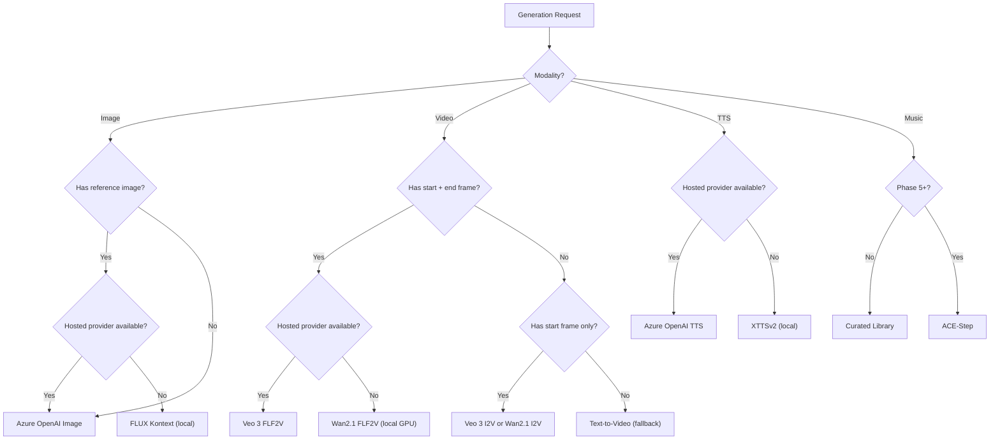

# Provider Capability Matrix

This appendix provides a quick-reference capability matrix for all generation providers the platform supports or plans to support. For full adapter specifications and integration details, see `architecture/06-provider-abstraction-and-integration-architecture.md`.

---

## Image Generation Providers

| Provider | Type | Reference Image | Multi-Reference | Inpainting | 9:16 | Commercial License | Platform Priority |
|---|---|---|---|---|---|---|---|
| Azure OpenAI (GPT-Image / DALL-E) | Cloud API | ✅ | ✅ | ✅ | ✅ | ✅ Enterprise | Primary hosted |
| Gemini 2.5 Flash Image | Cloud API | ✅ | ✅ (fusion) | ✅ | ✅ | ✅ Vertex AI | Alternative hosted |
| FLUX Kontext | Open-source | ✅ (Kontext edit) | Limited | ✅ | ✅ | ⚠️ Non-commercial default | Open fallback |
| Stable Diffusion (SD3/SDXL) | Open-source | Via ControlNet | Limited | ✅ | ✅ | ✅ Permissive variants | Open fallback |

### Key For Image Generation

- **Reference Image:** Can accept a reference image as input for style/character consistency.
- **Multi-Reference:** Can accept multiple reference images simultaneously.
- **Inpainting:** Can edit a specific region of an existing image.
- **9:16:** Supports vertical aspect ratio output.

---

## Video Generation Providers

| Provider | Type | First-Frame | Last-Frame | FLF2V | Silent Output | Max Duration | 9:16 | VRAM Required | Platform Priority |
|---|---|---|---|---|---|---|---|---|---|
| Veo 3 (Vertex AI) | Cloud API | ✅ | ✅ | ✅ | ✅ (`generateAudio=false`) | 4/6/8s | ✅ | N/A (cloud) | Primary hosted |
| Wan2.1 FLF2V (14B) | Open-source | ✅ | ✅ | ✅ | ✅ (no audio) | ~5s | ✅ | 24GB+ | Primary open-source |
| Wan2.1 I2V (14B) | Open-source | ✅ | ❌ | ❌ | ✅ (no audio) | ~5s | ✅ | 16GB+ | Fallback open-source |
| CogVideoX | Open-source | ✅ | ❌ | ❌ | ✅ (no audio) | ~6s | ✅ | 16GB+ | Fallback open-source |

### Key For Video Generation

- **First-Frame / Last-Frame / FLF2V:** Whether the model can accept start and/or end frame images for video interpolation. FLF2V (first/last frame to video) is the preferred mode for paired-frame generation.
- **Silent Output:** Whether the provider can output video without audio, or audio must be stripped post-generation.

---

## Audio / TTS Providers

| Provider | Type | Voice Cloning | Multi-Language | Streaming | Speed Control | VRAM Required | Platform Priority |
|---|---|---|---|---|---|---|---|
| Azure OpenAI TTS (gpt-4o-mini-tts) | Cloud API | ❌ | ✅ | ✅ | ✅ | N/A | Primary hosted |
| XTTSv2 | Open-source | ✅ | ✅ | ✅ | ✅ | 4GB+ | Primary open-source |
| Kokoro | Open-source | ❌ | Limited (EN) | ✅ | ✅ | CPU ok | Lightweight fallback |
| CosyVoice | Open-source | ✅ | ✅ | ✅ | ✅ | 4GB+ | Alternative open-source |
| GPT-SoVITS | Open-source | ✅ | ✅ | ❌ | ✅ | 4GB+ | Alternative open-source |

---

## Music Generation Providers

| Provider | Type | Text-Conditioned | Duration Control | VRAM Required | Platform Priority |
|---|---|---|---|---|---|
| Curated royalty-free library | Bundled | N/A (selection) | Full track | None | Phase 3 default |
| ACE-Step v1.5 | Open-source | ✅ | ✅ | 4GB+ | Phase 5+ |
| Stable Audio Open | Open-source | ✅ | ✅ | 8GB+ | Phase 5+ alternative |

---

## Text / LLM Providers

| Provider | Type | Structured Output | Long Context | Platform Priority |
|---|---|---|---|---|
| Azure OpenAI (GPT-4o) | Cloud API | ✅ (JSON mode) | ✅ (128K) | Primary hosted |
| Gemini 2.5 Flash | Cloud API | ✅ | ✅ (1M) | Alternative hosted |
| Ollama (Llama, Qwen) | Open-source | ✅ (with guidance) | Varies | Phase 7 fallback |

---

## Licensing Quick Reference

| Model | License | Commercial Use | Notes |
|---|---|---|---|
| Azure OpenAI models | Commercial API | ✅ | Enterprise agreement |
| Veo 3 (Vertex AI) | Commercial API | ✅ | Google Cloud agreement |
| Wan2.1 | Apache 2.0 | ✅ | Safe for production |
| CogVideoX | Custom per variant | ⚠️ Check | Review per model card |
| FLUX Kontext Dev | BFL custom | ❌ Default | Requires commercial license purchase |
| Stable Diffusion (SDXL) | CreativeML Open RAIL-M | ✅ | With usage restrictions |
| XTTSv2 | Coqui CPML | ⚠️ Conditional | Review Coqui terms |
| Kokoro | Apache 2.0 | ✅ | Safe for production |
| ACE-Step | Apache 2.0 | ✅ | Safe for production |
| Stable Audio Open | Stability AI | ⚠️ Conditional | Review commercial terms |

---

## Required Capability Checks

Before a provider is used in production for a modality, confirm:

- 9:16 output support where required
- Start-frame and end-frame support if the step expects it
- Silent clip output support or reliable post-generation stripping
- License and commercial-usage compatibility
- Observability and request ID visibility
- Reference image input support for consistency chaining

---

## Provider Selection Decision Tree

