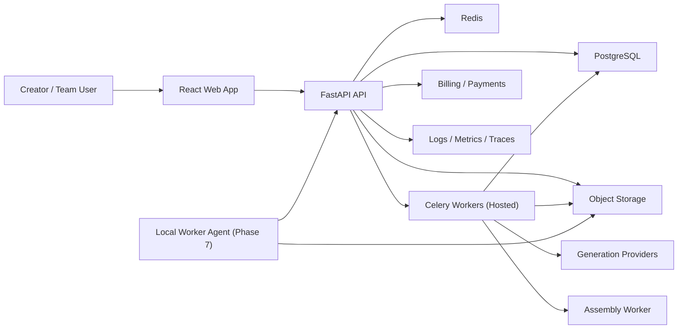

# System Context

## Overview

The platform is a web-based application that coordinates user workflows and asynchronous media generation across multiple providers and internal workers. The key design choice is to separate product orchestration from generation execution so the user-facing workflow remains stable even if generation providers change.

## System Context Diagram

### Write Path Clarification

Workers write state through **two distinct paths**:

- **Direct writes to PostgreSQL and S3:** Workers write step completion status, asset references, cost metadata, and provider run records directly to the database and object storage. This is the hot path for all job progress updates.
- **Coordination through the API:** Workers call the API only when a state transition requires product-level business logic (for example, advancing a render job from `running` to `completed` after all steps succeed, or triggering a user notification). Raw job-step writes bypass the API entirely to avoid a bottleneck.

This means the diagram arrows from `Workers → PG` and `Workers → S3` are first-class write paths, not exceptional cases.

## Logical Subsystems

- Product application: authentication, workspaces, projects, drafts, presets, approval state, exports, billing views.
- Orchestration backend: API endpoints, domain rules, job creation, state transitions, permissions.
- Worker layer: rendering tasks, provider calls, retries, step checkpoints, FFmpeg composition, subtitle processing.
- Data and storage: relational entities, usage records, prompt versions, scene assets, exports, and lifecycle metadata.
- Integration layer: providers for generation, payment processor, email/notifications, and future local worker agents.

## Core Data And Control Flow

1. The user submits or edits a brief.
2. The API creates or updates a project draft and enqueues generation for ideas or scripts.
3. The worker performs the generation step and writes step status, cost, latency, and generated asset references directly to PostgreSQL and object storage.
4. The user approves a script and scene plan.
5. The API creates a render job with per-scene steps.
6. Workers execute each step independently: writing step status, cost, latency, and asset references directly to PostgreSQL and object storage for each step.
7. After all scene steps complete successfully, the orchestration service transitions the render job state and enqueues the composition step.
8. FFmpeg workers build the final export and write the export record directly to PostgreSQL and S3.
9. The API surfaces the export and its metadata to the web app.

## Bounded Contexts

- Identity and access
- Workspace and billing
- Project planning
- Scene planning and presets
- Visual consistency and asset memory
- Asset generation and provider execution
- Export composition and delivery
- Content moderation and safety
- Observability and operations

## Key Invariants

- User-facing state changes that require business logic happen through the API. Step-level progress writes (status, cost, assets) happen directly from workers to the database.
- Every expensive operation must be representable as a resumable step with a stable identifier.
- Provider outputs must be normalized into the platform domain model before any downstream step consumes them.
- Asset storage keys must be deterministic enough to support retries, deduplicating, and cleanup.
- The consistency pack must be fully resolved before any image or video generation step begins.

## Major Risks Addressed By This Architecture

- Provider churn
- Long-running job failure
- Partial render failure
- Cost opacity
- Inconsistent product behavior across providers
- Visual consistency drift across multi-scene exports

