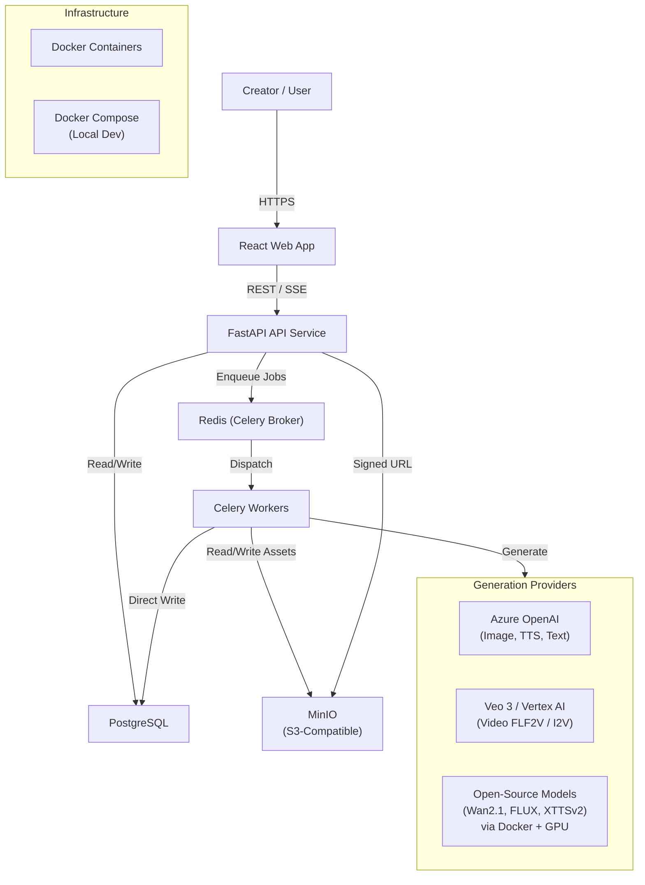
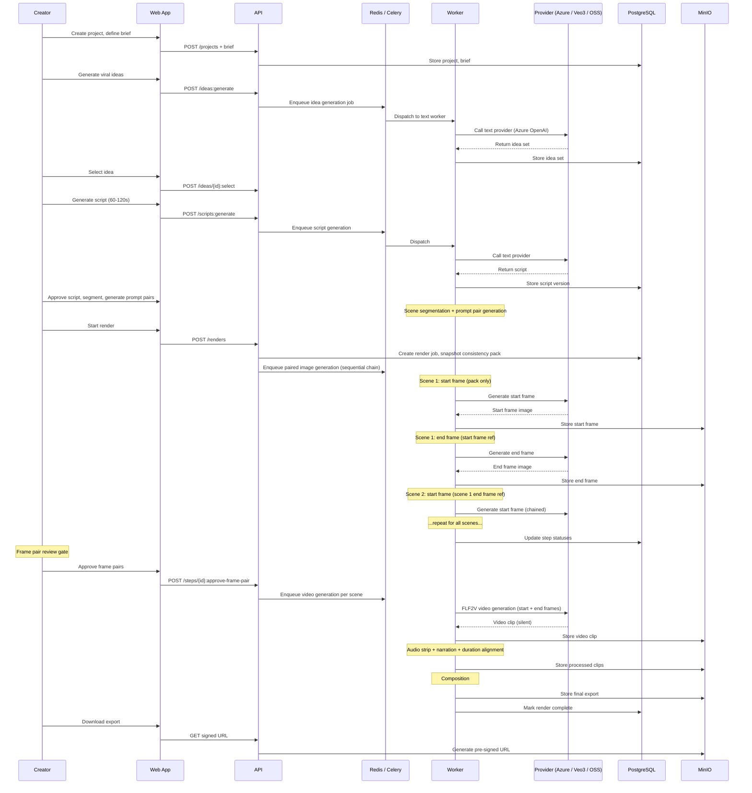

# System Context And Architecture

## Overview

The Reels Generation Platform is a service-oriented SAAS product. It is not a monolith. The first releases will ship as a small set of coordinated services — a web client, an API gateway, background workers, and storage — with the option to scale each layer independently as demand grows.

## System Context Diagram

## Service Decomposition

| Service | Technology | Purpose |
|---|---|---|
| **Web App** | React, TypeScript, Vite, Tailwind CSS | Creator-facing UI |
| **API Service** | FastAPI, Pydantic, SQLAlchemy | REST endpoints, domain operations, job submission |
| **Workers** | Celery, Redis | Async generation jobs, composition, audio strip, duration alignment |
| **Database** | PostgreSQL | Domain data, workflow state, usage records |
| **Object Storage** | MinIO (S3-compatible) | Media assets, exports, quarantine, model weights |
| **Broker** | Redis | Celery message broker, SSE buffer, rate limit state, cache |
| **Composition Worker** | FFmpeg, ffmpeg-python | Video assembly, audio stripping, speed-matching, loudness normalisation |
| **GPU Workers** | Docker + CUDA | Self-hosted open-source model inference (Wan2.1, FLUX, XTTSv2) |

## Core Data / Control Flow

## The Worker Write Path

The architecture uses a **direct write path** for workers: workers write their results directly to PostgreSQL and MinIO without routing through the API service. This avoids creating a bottleneck at the API layer during heavy generation workloads.

Rules:
- Workers open their own database sessions (sync, managed directly by worker code, not FastAPI's `Depends`).
- Workers use the MinIO/S3 SDK directly for asset storage.
- Workers never call API endpoints to report results — they write directly to the database.
- The API reads the same database tables to serve status queries to the frontend.
- SSE events are published by workers to Redis and consumed by the API for delivery to connected clients.

## Deployment Units

| Unit | Container | GPU Required | Autoscaling Signal |
|---|---|---|---|
| Web App | `reels-frontend` | No | Request rate |
| API Service | `reels-api` | No | Request rate / connection count |
| Planning Workers | `reels-worker-planning` | No | Queue depth (planning queue) |
| Image Generation Workers | `reels-worker-image` | Optional (GPU for open-source) | Queue depth (image queue) |
| Video Generation Workers | `reels-worker-video` | Yes (for open-source models) | Queue depth (video queue) |
| Audio / TTS Workers | `reels-worker-audio` | Optional | Queue depth (audio queue) |
| Composition Workers | `reels-worker-composition` | No | Queue depth (composition queue) |
| PostgreSQL | `reels-postgres` | No | N/A (managed or single instance) |
| Redis | `reels-redis` | No | N/A |
| MinIO | `reels-minio` | No | N/A |

## Key Constraints

- **Sequential image generation:** Frame pair generation is sequential across scenes due to reference chaining. Scene N depends on scene N-1's end frame. This is an architectural constraint, not a performance bug.
- **Provider audio policy:** Video generation must always request silent output or strip audio post-generation. Provider-generated audio must never reach the composition pipeline.
- **Consistency pack snapshot:** Every render job captures its consistency pack at creation time. Workers always read the snapshot, never the live pack.
- **Signed URLs for all asset access:** No direct public URLs for any stored assets. All client-facing URLs are pre-signed with short TTL.
