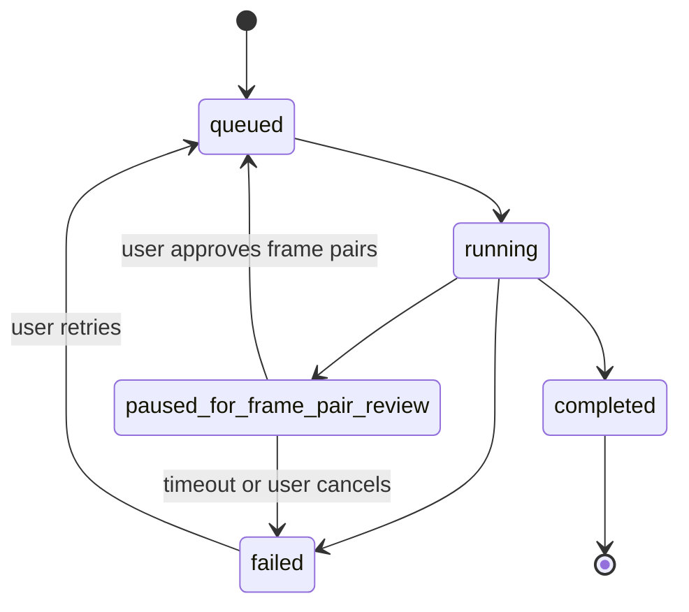

# Job Orchestration And Render Pipeline

## Why A Job-Based Pipeline

Video generation is too expensive and failure-prone to treat as one blocking request. The platform should model rendering as a series of durable, resumable steps so partial failure does not destroy the entire user workflow.

## Pipeline Stages

1. Brief processing
2. Idea generation
3. Idea selection
4. Script generation
5. Scene segmentation
6. Scene planning and prompt-pair generation
7. User approval gates
8. Consistency pack resolution and snapshot
9. Chained frame-pair generation per scene
10. Output moderation on generated frame pairs
11. Frame-pair review
12. Video generation per scene using start and end frames where supported
13. Output moderation on generated video clips
14. Source-audio stripping or silent-clip normalization
15. Narration generation per scene
16. Music preparation
17. Subtitle generation
18. Clip retiming and per-scene A/V alignment
19. Final composition and export

## Render Job Model

- One `render_job` represents a single output attempt.
- Each job contains ordered `render_steps`.
- Each step tracks status, retries, provider run IDs, output asset IDs, error details, and timestamps.
- Each scene-specific step is independently retryable where dependency rules permit it.
- A render job is permanently bound to the approved `script_version_id` and `scene_plan_id` that existed at creation time.

## State Machine

### `paused_for_frame_pair_review` State

This state is triggered after all scene frame pairs have been generated and before video generation begins. The user is shown generated start/end frames and can:

- Approve all frame pairs and continue to video generation.
- Regenerate specific scene frame pairs with adjusted prompt parameters.
- Replace a frame with an uploaded reference image.

If a scene frame pair is changed after downstream scenes have already been generated in the chain, the downstream scenes are marked stale and must be regenerated from that point forward.

## Chained Frame-Pair Generation

The canonical continuity rule is:

- Scene 1 start frame uses the consistency pack only.
- Scene 1 end frame references scene 1 start frame.
- Scene `N` start frame references scene `N-1` end frame plus the consistency pack.
- Scene `N` end frame references scene `N` start frame plus the consistency pack.

This means frame-pair generation is ordered, not fully parallel. Later scenes may not start until the previous scene's end frame is approved or locked for use.

## Checkpoint Strategy

- Store step completion markers in PostgreSQL.
- Write generated assets to object storage immediately after each successful step.
- Avoid recomputing approved planning inputs.
- Allow the orchestration service to resume from the last successful step.
- Consistency pack is resolved once per render job at job creation time and snapshotted.
- Chained scene rendering checkpoints on approved end frames, not just on video clips.

## Retry Strategy

- Retry transient provider failures automatically with bounded exponential backoff.
- Surface deterministic failures to the user with scene-level context.
- Support manual retry for one scene, one asset type, or the final composition step.
- Do not retry moderation rejections automatically.
- If a start or end frame retry changes a continuity anchor, later chained scenes are invalidated and explicitly re-enqueued.

## Music Step

Music is a dedicated tracked step within the render pipeline with its own status:

- `music_preparation`
- runs in parallel with scene asset generation where possible
- must complete before final composition
- can fall back to silence if `allow_export_without_music` is enabled

## Subtitle Step

Subtitle generation is a non-blocking tracked step:

- runs after narration is complete
- can fail without blocking export delivery
- is surfaced as a warning, not a render failure

## Queue Design

- Separate queues for planning, frame generation, video generation, audio normalization, retiming, composition, music, and maintenance jobs.
- Use priority levels so user-facing retries are not blocked behind background maintenance work.
- Reserve heavy queues for video and FFmpeg composition tasks.
- Queue depth is the primary autoscaling signal for worker pool sizing.

## Observability Requirements

- Track duration and cost per step.
- Capture provider latency, failure codes, retry counts, and whether a video clip arrived with an audio stream.
- Emit correlation IDs linking API requests, job IDs, and provider runs.
- Record chain invalidation events when a scene change forces downstream regeneration.

## Composition Rules

The composition step is orchestrated as a distinct render step (`composition`) with its own status tracking, retry policy, and provider run record. It runs only after all required scene assets, normalized silent clips, narration, and the music track are in `completed` state.

Binding rules enforced at the orchestration layer:

- Composition dependency gate: every required scene step (frame pair, video, silent clip, narration, retime) and the music step must be `completed`.
- Consistency provenance check: all scene clip assets must reference the same `consistency_pack_snapshot_id`.
- Source-audio policy: provider-returned clip audio is never mixed directly into the export in the default pipeline.
- Duration sync: narration audio and the corresponding video clip duration are reconciled with bounded speed adjustment first, then freeze-pad or trim if needed.
- Music ducking: background music attenuates by -12 dB during narration sections and fades back over 0.3 seconds.
- Loudness normalisation: final mix is normalised to -14 LUFS integrated with -1.0 dBTP true peak limit.
- Voice continuity: all narration steps within one render job must use the identical `voice_preset_id`, frozen at job creation.
- Scene transitions: default is `hard_cut`. Crossfade is configurable from Phase 5 onward.
- Subtitle burn-in: applied at composition time from the subtitle file.
- FFmpeg command construction: built programmatically from a validated asset manifest.
