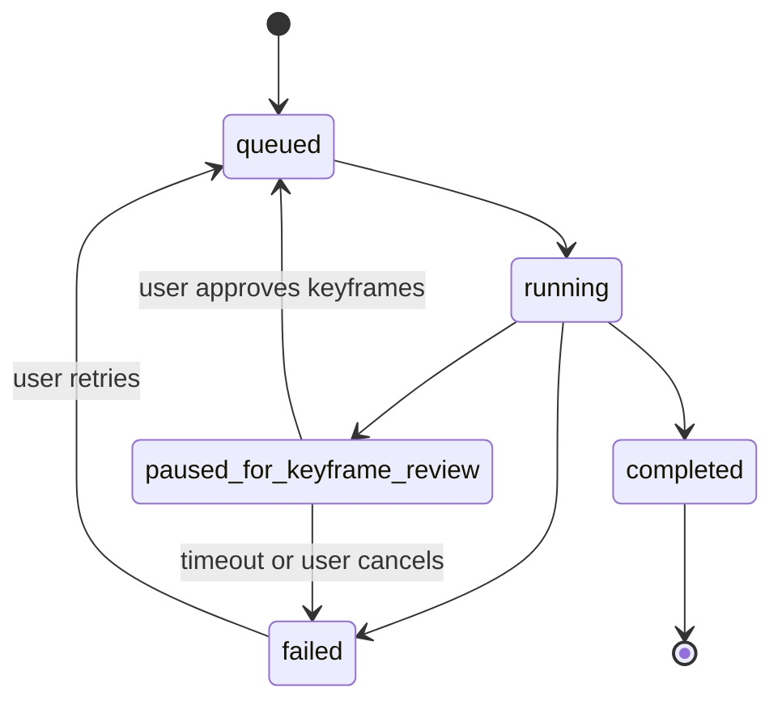

# Job Orchestration And Render Pipeline

## Why A Job-Based Pipeline

Video generation is too expensive and failure-prone to treat as one blocking request. The platform should model rendering as a series of durable, resumable steps so partial failure does not destroy the entire user workflow.

## Pipeline Stages

1. Brief processing
2. Idea generation
3. Script generation
4. Scene segmentation
5. Scene planning
6. User approval gates
7. Consistency pack resolution and snapshot
8. Keyframe image generation per scene
9. Output moderation on generated keyframes
10. Keyframe review (user approval gate before video generation)
11. Video generation per scene (image-to-video preferred when keyframe approved)
12. Output moderation on generated video clips
13. Narration generation per scene
14. Music preparation (selection from curated library or generation)
15. Subtitle generation and timing alignment
16. Final composition and export

Not every phase of delivery exposes all stages to users, but the architecture should already reflect the full shape.

## Render Job Model

- One `render_job` represents a single output attempt.
- Each job contains ordered `render_steps`.
- Each step tracks status, retries, provider run IDs, output asset IDs, error details, and timestamps.
- Each scene-specific step is independently retryable.
- A render job is permanently bound to the approved `script_version_id` and `scene_plan_id` that existed at creation time. Later drafts or re-approvals do not affect running or completed jobs.

## State Machine

### `paused_for_keyframe_review` State

This state is triggered after all scene keyframe images have been generated and before video generation begins. The user is shown generated keyframes and can:

- Approve all keyframes and continue to video generation.
- Regenerate specific keyframes with adjusted prompt parameters.
- Replace a keyframe with an uploaded reference image.

The job remains in `paused_for_keyframe_review` until the user takes an action or a configurable timeout is reached (default: 7 days). If the timeout is reached without action, the job transitions to `failed` with reason `keyframe_review_timeout`.

## Checkpoint Strategy

- Store step completion markers in PostgreSQL.
- Write generated assets to object storage immediately after each successful step.
- Avoid recomputing approved planning inputs.
- Allow the orchestration service to resume from the last successful step.
- Consistency pack is resolved once per render job at job creation time and snapshotted. Workers always read from the snapshot, not the live consistency pack.

## Retry Strategy

- Retry transient provider failures automatically with bounded exponential backoff (max 5 automatic retries per step).
- Surface deterministic failures to the user with scene-level context.
- Support manual retry for one scene, one asset type, or the final composition step.
- Do not retry moderation rejections automatically — these require user intervention.

## Music Step

Music is a dedicated tracked step within the render pipeline with its own status:

- **Step type:** `music_preparation`
- **States:** `queued`, `running`, `completed`, `failed`
- Music preparation runs in parallel with scene asset generation steps where possible.
- Music preparation must complete before the final composition step begins (it is a composition dependency).
- If music preparation fails, the composition step can proceed with a fallback silent track if the user has enabled the `allow_export_without_music` setting. Otherwise the render job fails.
- Supported music sources (resolved at job creation time): `curated_track` (Phase 3 default), `generated_track` (Phase 5+), `uploaded_track`.

## Subtitle Step

Subtitle generation is a **non-blocking** tracked step:

- Subtitle generation runs after narration is complete.
- If subtitle generation fails, the export is delivered with `subtitles: null` in its metadata.
- The export is not held back by a subtitle failure. The user is informed via a render warning, not a render failure.
- Subtitle availability is a per-export flag surfaced in the export library.

## Queue Design

- Separate queues for planning, generation, composition, music, and maintenance jobs.
- Use priority levels so user-facing retries are not blocked behind background maintenance work.
- Reserve heavy queues for video and FFmpeg composition tasks.
- Queue depth is the primary autoscaling signal for worker pool sizing — not CPU utilization.

## Observability Requirements

- Track duration and cost per step.
- Capture provider latency, failure codes, and retry counts.
- Emit correlation IDs linking API requests, job IDs, and provider runs.

## Composition Rules

The composition step is orchestrated as a distinct render step (`composition`) with its own status tracking, retry policy, and provider run record. It runs only after all required scene assets and the music track are in `completed` state.

**Full composition strategy is specified in `14-composition-and-av-consistency.md`.** The following are the binding rules enforced at the orchestration layer:

- **Composition dependency gate:** The composition step will not be dispatched until every required scene step (image, video, narration) and the music step are marked `completed`. Non-blocking steps (subtitle, output moderation on audio) do not block dispatch.
- **Consistency provenance check:** The composition worker verifies that all scene clip assets reference the same `consistency_pack_snapshot_id` as the render job. A mismatch fails composition with `consistency_snapshot_mismatch` — the platform will never deliver a visually inconsistent export silently.
- **Duration sync:** Narration audio and the corresponding video clip duration are reconciled before assembly. If narration is longer, the clip is freeze-frame padded. If the clip is more than 3 seconds longer than narration, it is trimmed.
- **Music ducking:** Background music attenuates by −12 dB during narration sections and fades back over 0.3 seconds to prevent audio pumping.
- **Loudness normalisation:** Final mix is normalised to −14 LUFS integrated with −1.0 dBTP true peak limit (standard for TikTok and Instagram Reels).
- **Voice continuity:** All narration steps within one render job must use the identical `voice_preset_id`, frozen at job creation.
- **Scene transitions:** Default is `hard_cut`. Crossfade (0.25–0.5 s dissolve) is configurable via the visual preset from Phase 5 onward.
- **Subtitle burn-in:** Applied at composition time from the subtitle file. If the subtitle step failed, the export proceeds without subtitles.
- **FFmpeg command construction:** Built programmatically from a validated asset manifest. Never interpolated from user-provided strings. Full command logged in the composition provider run record.

