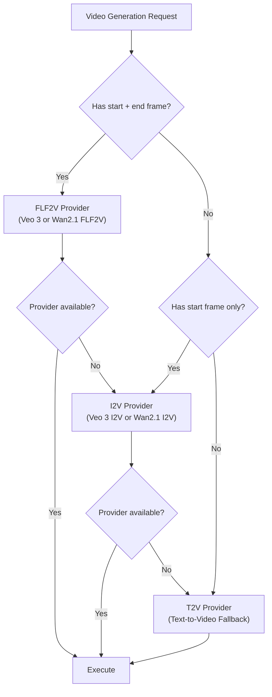

# Provider Abstraction And Integration Architecture

## Why An Adapter Layer

The platform must integrate with multiple AI generation providers — cloud APIs for image, video, and speech, as well as self-hosted open-source models. Providers will change over time as new models become available and pricing shifts. The adapter layer isolates the product domain from provider-specific APIs so the platform can swap, add, or deprecate providers without rewriting domain logic.

## Design Approach

Each generation modality is fronted by a platform-defined interface:

```python
class ImageProvider(Protocol):
    async def generate(self, request: ImageGenerationRequest) -> ImageGenerationResult: ...

class VideoProvider(Protocol):
    async def generate(self, request: VideoGenerationRequest) -> VideoGenerationResult: ...

class SpeechProvider(Protocol):
    async def generate(self, request: SpeechGenerationRequest) -> SpeechGenerationResult: ...

class TextProvider(Protocol):
    async def generate(self, request: TextGenerationRequest) -> TextGenerationResult: ...

class MusicProvider(Protocol):
    async def generate(self, request: MusicGenerationRequest) -> MusicGenerationResult: ...
```

All adapters implement one of these interfaces and must comply with four rules:

1. **Normalise all outputs** into platform-native records (assets with metadata, timing, and provenance).
2. **Never expose provider-specific domain concepts** to calling code beyond the adapter boundary.
3. **Return structured errors** from the platform's error taxonomy, not raw HTTP errors or provider exception types.
4. **Record every call** as a `provider_run` with inputs, outputs, cost, latency, and error details.

## Provider Capability Matrix

### Image Generation

| Provider | Reference Image Input | Multi-Reference | Image Editing / Inpainting | Commercial License | Priority |
|---|---|---|---|---|---|
| **Azure OpenAI** (GPT-Image / DALL-E) | ✅ Yes | ✅ Yes | ✅ Yes | ✅ Yes (Enterprise) | Primary hosted |
| **Gemini 2.5 Flash Image** | ✅ Yes | ✅ Yes (multi-image fusion) | ✅ Yes | ✅ Yes (Vertex AI) | Alternative hosted |
| **FLUX Kontext** (open-source) | ✅ Yes (Kontext editing) | Limited | ✅ Yes | ⚠️ Non-commercial by default | Open fallback |
| **Stable Diffusion** (open-source) | Via ControlNet | Limited | Via inpainting | ✅ Yes (permissive variants) | Open fallback |

### Video Generation

| Provider | First-Frame Input | Last-Frame Input | First+Last Frame (FLF2V) | Silent Output | Max Duration | 9:16 Support | Priority |
|---|---|---|---|---|---|---|---|
| **Veo 3** (Google Vertex AI) | ✅ Yes | ✅ Yes | ✅ Yes | ✅ Yes (`generateAudio=false`) | 4/6/8 sec | ✅ Yes | Primary hosted |
| **Wan2.1 FLF2V** (open-source) | ✅ Yes | ✅ Yes | ✅ Yes | ✅ Yes (no audio track) | ~5 sec | ✅ Yes | Primary open-source |
| **Wan2.1 I2V** (open-source) | ✅ Yes | ❌ No | ❌ No | ✅ Yes | ~5 sec | ✅ Yes | Fallback open-source |
| **CogVideoX** (open-source) | ✅ Yes | ❌ No | ❌ No | ✅ Yes | ~6 sec | ✅ Yes | Fallback open-source |

### Audio / TTS

| Provider | Voice Cloning | Multi-Language | Streaming | Per-Scene Duration | Priority |
|---|---|---|---|---|---|
| **Azure OpenAI TTS** (gpt-4o-mini-tts) | ❌ No | ✅ Multilingual | ✅ Yes | ✅ Yes | Primary hosted |
| **XTTSv2** (open-source) | ✅ Yes | ✅ Multilingual | ✅ Yes | ✅ Yes | Primary open-source |
| **Kokoro** (open-source) | ❌ No | Limited (English) | ✅ Yes | ✅ Yes | Lightweight fallback |
| **CosyVoice** (open-source) | ✅ Yes | ✅ Multilingual | ✅ Yes | ✅ Yes | Alternative open-source |

### Music Generation

| Provider | Text-Conditioned | Duration Control | Local Feasibility | Priority |
|---|---|---|---|---|
| **Curated royalty-free library** | N/A (selection) | Full track | ✅ Bundled | Phase 3 default |
| **ACE-Step v1.5** (open-source) | ✅ Yes | ✅ Yes | ✅ Low VRAM | Phase 5+ |
| **Stable Audio Open** (open-source) | ✅ Yes | ✅ Yes | ✅ Yes | Phase 5+ alternative |

## Concrete Adapter Specifications

### AzureOpenAIImageProvider

```python
class AzureOpenAIImageProvider(ImageProvider):
    """Azure OpenAI DALL-E / GPT-Image adapter for image generation with reference input."""

    # Capabilities:
    # - Text-to-image generation
    # - Image editing with reference image input
    # - Multi-reference consistency via image + text input
    # - 9:16 aspect ratio support
    #
    # Required config: azure_endpoint, api_key, api_version, model_deployment
    # Reference handling: Pass consistency pack references as image inputs
    # Chain handling: Pass previous scene's end frame as primary reference image
```

### Veo3VideoProvider

```python
class Veo3VideoProvider(VideoProvider):
    """Google Veo 3 adapter for first-frame/last-frame video generation."""

    # Capabilities:
    # - First-frame + last-frame video interpolation (FLF2V)
    # - Single-frame image-to-video (I2V)
    # - Text-to-video (T2V) fallback
    # - Silent video output (generateAudio=false)
    # - Duration options: 4, 6, or 8 seconds
    # - 9:16 aspect ratio support
    #
    # Required config: project_id, location, credentials
    # Frame pair handling: Pass start_image as firstFrame, end_image as lastFrame
    # Audio policy: Always set generateAudio=false for composition workflow
    #
    # Duration constraint: Veo 3 supports 4/6/8 second clips only.
    # If target segment is 5 or 7 seconds, round to nearest supported duration.
    # Duration alignment step handles final clip-to-narration matching.
```

### Wan21VideoProvider

```python
class Wan21VideoProvider(VideoProvider):
    """Wan2.1 adapter for local/self-hosted video generation."""

    # Capabilities:
    # - FLF2V mode: First-frame + last-frame interpolation (Wan2.1-FLF2V-14B)
    # - I2V mode: Single reference image to video (Wan2.1-I2V-14B)
    # - T2V mode: Text-only fallback (Wan2.1-T2V-14B)
    # - No audio track in output
    # - Consumer GPU support (RTX 3090+ for I2V, RTX 4090 recommended for FLF2V)
    #
    # Required config: model_path, device, dtype
    # Deployment: Docker container with CUDA, model weights volume-mounted
    # Latency: ~4 min per 5-sec 480p clip on RTX 4090 (without optimizations)
```

### AzureOpenAISpeechProvider

```python
class AzureOpenAISpeechProvider(SpeechProvider):
    """Azure OpenAI TTS adapter for per-scene voiceover generation."""

    # Capabilities:
    # - Multiple voice profiles
    # - Per-scene narration generation
    # - Speed and pitch control
    # - Streaming output
    #
    # Required config: azure_endpoint, api_key, api_version, model (gpt-4o-mini-tts)
    # Voice continuity: Same voice_preset_id frozen at render job creation
    # Output: Single audio file per scene in WAV or AAC format
```

### OpenSourceTTSProvider

```python
class OpenSourceTTSProvider(SpeechProvider):
    """Generic adapter for self-hosted open-source TTS models."""

    # Supported models: XTTSv2, Kokoro, CosyVoice, GPT-SoVITS
    # Capabilities vary by model:
    # - XTTSv2: Voice cloning, multilingual, inference via Docker
    # - Kokoro: Lightweight English TTS, fast inference, low VRAM
    # - CosyVoice: Voice cloning, multilingual
    #
    # Required config: model_name, endpoint_url (local Docker container)
    # Deployment: Docker container, model weights volume-mounted
```

## VideoGenerationRequest Fields

The video generation request must support the paired-frame workflow:

```python
@dataclass
class VideoGenerationRequest:
    scene_segment_id: str
    prompt_text: str
    start_frame_asset_id: str | None  # Primary reference frame
    end_frame_asset_id: str | None    # End reference frame (for FLF2V)
    consistency_pack_snapshot_id: str
    target_duration_seconds: float
    aspect_ratio: str  # "9:16"
    generate_audio: bool  # Always False for composition workflow
    provider_config: dict  # Provider-specific overrides
```

## ImageGenerationRequest Fields

```python
@dataclass
class ImageGenerationRequest:
    scene_segment_id: str
    prompt_text: str                    # Assembled prompt from prompt construction layer
    frame_position: str                 # "start" or "end"
    reference_image_ids: list[str]      # Ordered: [chain_ref, style_ref, pack_refs...]
    consistency_pack_snapshot_id: str
    negative_prompt: str
    seed: int | None
    aspect_ratio: str  # "9:16"
    provider_config: dict
```

## Error Taxonomy

Provider errors must be classified into four categories:

| Category | Retry | Example |
|---|---|---|
| `transient` | Yes (automatic backoff) | Provider 5xx, timeout, rate limit, network error |
| `deterministic_input` | No (requires prompt change) | Invalid prompt, unsupported aspect ratio, content policy violation |
| `moderation_rejection` | No (requires user action) | Output flagged by safety filter |
| `internal` | No (requires code fix) | Adapter bug, malformed request |

## Provider Selection Logic

Provider routing is determined by:

1. **Workspace-level routing policy** — which execution mode and provider per modality
2. **Provider capability match** — the request's required capabilities vs provider support (e.g., FLF2V required → must route to Veo 3 or Wan2.1 FLF2V)
3. **Provider availability** — health check status and rate limit headroom
4. **Cost tier** — workspace plan determines access to premium providers

### Selection Fallback Chain



## Provider Run Record

Every generation call creates a `provider_run` record:

- Request payload (prompt, references, parameters, consistency pack snapshot ID, chain reference)
- Provider name and model version
- Response metadata (output asset IDs, timing, cost)
- Latency (start to completion)
- Error details if failed
- Retry count
- Whether silent output was requested (for video)
- Which frame inputs were used (start only, both, or none)

## Open-Source Model Hosting

Open-source models run in Docker containers with GPU access:

- **Image models** (FLUX, Stable Diffusion): Docker container with CUDA, model weights volume-mounted, exposed via internal REST endpoint
- **Video models** (Wan2.1, CogVideoX): Docker container with CUDA, high VRAM requirement (16GB+ for I2V, 24GB+ for FLF2V)
- **TTS models** (XTTSv2, Kokoro): Docker container, CPU or GPU, model weights volume-mounted

All open-source model containers register as internal provider endpoints. The adapter layer treats them identically to cloud API endpoints — same request/response contract, same provider run recording.

## Licensing And Commercial Readiness

Before using any open-source model in production:

| Model | License | Commercial Use Allowed | Action Required |
|---|---|---|---|
| FLUX.1 Kontext Dev | Custom (non-commercial by default) | ❌ Without license purchase | Verify BFL commercial license terms |
| Wan2.1 | Apache 2.0 | ✅ Yes | Safe for production |
| CogVideoX | Custom | ⚠️ Check per variant | Review per model card |
| XTTSv2 | CPML (Coqui) | ⚠️ Conditional | Review Coqui CPML terms |
| Kokoro | Apache 2.0 | ✅ Yes | Safe for production |
| ACE-Step | Apache 2.0 | ✅ Yes | Safe for production |
| Stable Audio Open | Stability AI license | ⚠️ Conditional | Review commercial terms |

The decision log must record the licensing review outcome for each model before it enters the production adapter registry.

## Implementation Phasing

| Phase | Provider Work |
|---|---|
| Phase 1 | Text provider adapter (Azure OpenAI or equivalent) for idea and script generation |
| Phase 2 | Image prompt generation uses text provider; image provider interface defined |
| Phase 3 | Full image, video (FLF2V + I2V + T2V), and speech adapters for primary hosted providers (Azure OpenAI, Veo 3) |
| Phase 4 | Provider health checks, rate limit tracking, per-provider cost capture |
| Phase 5 | Music generation adapters (ACE-Step, Stable Audio) |
| Phase 7 | Open-source / local model adapters (Wan2.1, FLUX, XTTSv2) with Docker deployment |
