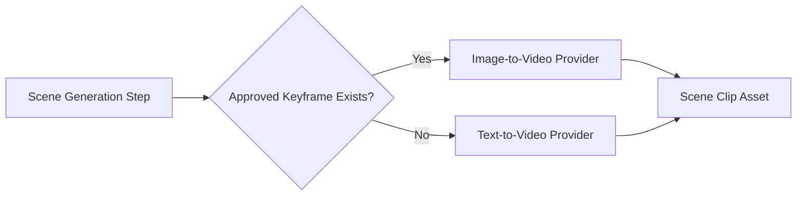

# Visual Consistency And Asset Memory

## Why This Document Exists

Maintaining visual consistency across a multi-clip short-form reel is the hardest technical problem on this platform. Each scene is generated independently, which means character appearance, color grading, environment tone, and spatial framing can drift between clips unless the platform enforces deliberate consistency controls from the moment a project is created.

This document defines the consistency model, the asset memory system, and how both feed into the generation pipeline.

## The Consistency Problem

When a 30–60 second reel is split into 5–10 second scene segments:

- Each image or video generation call receives only a text prompt unless the system deliberately passes reference context.
- Without reference anchoring, the same described character will appear differently across frames: face shape, outfit, skin tone, hair, and even proportions vary because generative models do not maintain state across calls.
- Even minor variations in prompt wording compound over multiple scenes, creating visual incoherence in the final export.

The solution is not to rely on model behavior for consistency. It is to enforce consistency through the platform's own data structures, stored references, and prompt construction.

## Consistency Pack

A **Consistency Pack** is the set of approved references and parameters that must be attached to every generation call for a given project or character. It is stored as a platform-native record tied to a project and optionally to a visual preset.

### Consistency Pack Components

| Component | Description |
|---|---|
| `reference_images` | One or more approved keyframe images used as visual anchors |
| `character_sheet` | Structured text describing appearance: face, body type, hair, outfit, skin tone |
| `style_descriptor` | Color palette, lighting style, lens type, mood, era |
| `negative_prompt` | Explicit exclusions to prevent unwanted variation |
| `seed_family` | A defined seed range or fixed seed used for reproducible generation attempts |
| `camera_defaults` | Default framing, aspect ratio, shot distance |
| `prompt_prefix` | A shared opening clause prepended to every visual generation prompt in the project |

### Consistency Pack Lifecycle


During Phase 2 (Content Planning), users define or select a visual preset that seeds the initial consistency pack. During Phase 3 (Render MVP), the first approved keyframe image for each scene becomes the reference image for the video generation call that follows.

## Asset Memory Model

Asset memory is the project-scoped record of all generation inputs and outputs that the system uses to maintain continuity across steps and across re-renders.

### Key Asset Memory Records

- `consistency_packs`: One per project, versioned alongside scene plans.
- `keyframes`: The approved image output for each scene segment, stored in object storage and referenced in the consistency pack after approval.
- `prompt_snapshots`: The exact prompt, seed, provider settings, and reference image IDs used for each generation call — stored on the `provider_run` record.
- `voice_memory`: The selected voice preset, pace, and tone used for narration, ensuring narrator voice stays consistent across scenes.
- `music_reference`: The selected or generated music track reference tied to the project-level export settings.

### Storage Layout Extension

```text
workspace/{workspace_id}/project/{project_id}/
  consistency/
    pack.json              ← versioned consistency pack snapshot
    reference_images/      ← approved keyframes used as visual anchors
    character_sheets/      ← text-based character and style definitions
  assets/
    images/                ← generated scene images
    videos/                ← generated scene clips
    ...
```

## Generation Prompt Construction

Every image and video generation request must be assembled by the platform using the following composition order:

1. **Global prompt prefix** from the consistency pack
2. **Scene-specific narration context** from the scene segment
3. **Scene-specific visual prompt** from the scene plan
4. **Style descriptor** from the visual preset
5. **Camera and framing instruction** from the scene segment or preset
6. **Negative prompt** from the consistency pack

The platform must never pass a raw user-written prompt directly to a provider adapter. Every prompt must be assembled through the prompt construction layer, which injects the consistency pack context.

### Image-to-Video Priority

Whenever an approved keyframe image exists for a scene, the generation pipeline must prefer **image-to-video** over text-to-video for that scene. This is the single most effective technique for reducing inter-scene visual drift.



## Consistency Review Step

After image generation but before video generation, the platform must offer a **keyframe review** step where the user can:

- Accept the generated keyframe and lock it as the reference for video generation.
- Regenerate the keyframe with adjusted prompt parameters.
- Replace the keyframe with an uploaded reference image.

This step prevents consistency failures from propagating into the expensive video generation phase. It is not optional for scenes with named characters or defined style packs.

## Visual Consistency Score (Phase 5 Forward)

In Phase 5, the platform should introduce an optional automated consistency score that compares:

- Embedding distance between successive keyframe images.
- Color histogram similarity across scene images.
- CLIP-based style coherence between generated images and the approved reference.

This score surfaces in the render monitor, allowing creators to identify divergent scenes before triggering the final composition step.

## Failure Handling

- If the consistency pack is missing or incomplete when a generation step begins, the step must fail with a clear error: `consistency_pack_required`.
- If a reference image has expired or been deleted, the system must warn the user and offer to regenerate or re-upload before proceeding.
- Prompt construction failures must be treated as deterministic errors and must not retry automatically.

## Interaction With Provider Abstraction

The consistency pack is a platform-native concept. Each provider adapter is responsible for translating consistency pack components into provider-specific parameters:

- For image providers that support reference image input (e.g., ControlNet reference mode, multi-reference API), the adapter passes the keyframe reference.
- For providers that do not support reference images, the adapter enriches the text prompt with the character sheet and style descriptor instead.
- The adapter must record in the provider run which consistency inputs were used and in what form.

## Implementation Phasing

| Phase | Consistency Work |
|---|---|
| Phase 1 | Define consistency pack schema in the database even if not yet populated |
| Phase 2 | Allow users to define visual presets that seed the consistency pack; store character sheets |
| Phase 3 | Enforce consistency pack usage in image and video generation; implement keyframe review step |
| Phase 5 | Introduce consistency scoring and lineage views showing how approved references were used |


