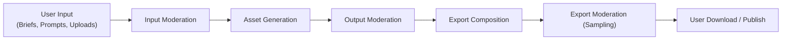
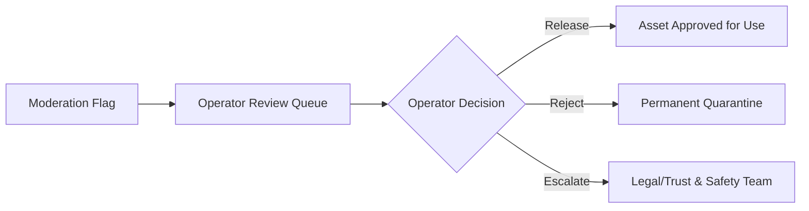

# Content Moderation And Safety

## Goals

- Prevent harmful or policy-violating content from being generated, stored, or exported by the platform.
- Operate moderation checks at platform boundaries rather than relying on provider-side filtering alone.
- Surface moderation decisions to users in clear, actionable terms without leaking sensitive classification details.
- Maintain an auditable record of moderation events separate from product analytics.

## Moderation Boundaries

Content on this platform crosses several distinct boundaries, each requiring its own check point.

### 1. Input Moderation

Applied to:
- Project briefs and topic descriptions before they are passed to text generation providers.
- Scene segment prompt content before image or video generation begins.
- User-uploaded reference images or brand assets (when user uploads are enabled in later phases).

**Mechanism:** Run a lightweight text classification pass on all user-provided text before it reaches a generation adapter. For uploaded files, run a hash-based blocklist check plus an image content classification call.

**Policy:** Block generation if input is classified as severely violating. Return a `content_policy_violation` error to the API caller with a generic reason category without exposing internal classifier labels.

### 2. Output Moderation

Applied to:
- Generated images before they are stored as approved keyframes.
- Generated video clips before they are referenced in scene plans.
- Generated narration audio (transcription-based check for text-to-speech scripts that may have varied from the approved script).

**Mechanism:**
- For image and video outputs: call the configured image safety classifier. If unsafe, the step fails with `output_rejected_by_moderation` and the asset is quarantined rather than deleted.
- For audio outputs: re-check the source script. If the TTS script matches the approved scene script, the audio check can be skipped. If the script was modified by the worker, re-run text moderation.

**Policy:** Reject and quarantine the asset. The render step is marked `failed` with reason `moderation_rejection`. Provider run metadata is preserved for operator review. The user sees a scene-level failure with a generic message.

### 3. Export Moderation

Applied to a sample of completed exports before download is made available. Full export scanning is not required per export — a statistical sampling policy is acceptable for the MVP.

**Mechanism:** Flag exports for review based on a configurable sampling rate or risk signals from earlier step failures. Operator reviews flagged exports before the download link is surfaced to the user.

## Moderation Modes

| Mode | Description | Default |
|---|---|---|
| `blocking` | Generation or export is blocked until moderation completes | Yes for input and output |
| `async_review` | Generation proceeds, human review queued in parallel | Optional for export sampling |
| `skip` | Moderation bypassed (operator override only, logged) | Never default |

## Provider-Level Safety

Most generation providers offer their own content filters. These are treated as a complementary layer, not a substitute for platform-level moderation.

- Always enable provider content safety filters in provider adapter configuration.
- If a provider returns a content policy rejection error, translate it to `provider_content_rejection` in the provider run record.
- Provider rejections count as retryable only if the error is transient, not if it is a deterministic content refusal.

## Moderation Provider Integration

The platform should integrate one configurable moderation provider through the same adapter pattern used for generation providers. The `ModerationProvider` interface accepts:

- `classify_text(text: str) → ModerationResult`
- `classify_image(image_url: str) → ModerationResult`

`ModerationResult` returns:
- `verdict`: `allowed`, `flagged`, `blocked`
- `categories`: List of triggered category identifiers (not exposed to users)
- `confidence`: Float score (operator visibility only)
- `moderation_run_id`: Unique identifier for audit linkage

### Rate Limiting And Caching

Moderation provider calls are subject to the same provider error taxonomy as generation providers (see `06-provider-abstraction`). Specifically:
- If the moderation provider returns a rate limit error (`429`), the error is categorized as `provider_rate_limited` and the calling step is retried with exponential backoff.
- To reduce moderation provider call volume and latency impact, the platform caches moderation results keyed by `(text_hash, provider_version)` in Redis with a 24-hour TTL. Identical prompts do not trigger repeated classification calls within the cache window.
- Image moderation results are **not** cached because generated image content is always unique.

## Quarantine And Audit

- Quarantined assets remain in object storage under a separate prefix: `workspace/{id}/project/{id}/quarantine/`
- Quarantine records are stored in the `moderation_events` table with: asset ID, step ID, verdict, categories, timestamp, and operator review status.
- Quarantine records must never be automatically deleted. Retention follows the operator's compliance policy (minimum 90 days recommended).
- Operators can release or permanently reject quarantined assets through the admin interface.

## Human Escalation Path

Human escalation is required for:
- Any export flagged from a workspace that has had multiple prior moderation events.
- Any content that triggers a severe harm category at high confidence.
- Any operator dispute from a user claiming a false positive.

## User-Facing Messages

Moderation failure messages shown to users must:
- Never expose classifier category labels.
- Offer a clear next action: edit the prompt, contact support, or review the content policy link.
- Not expose which specific classifier or provider made the decision.

Example user-facing message: *"This scene could not be generated because the content may not meet our content policy. Please adjust the scene description and try again."*

## False Positive Handling

- Users can submit a false positive report through the project interface. Reports queue for operator review.
- False positive submissions are logged against the specific moderation run.
- If an operator confirms a false positive, the asset is released from quarantine and the original render step may be marked as completed.

## Implementation Phasing

| Phase | Moderation Work |
|---|---|
| Phase 1 | Input text moderation on briefs and prompts |
| Phase 3 | Output moderation on generated images and video clips; quarantine model |
| Phase 4 | Operator review queue and audit trail |
| Phase 5 | Export sampling moderation |
| Phase 6 | User upload moderation when file upload is introduced |

