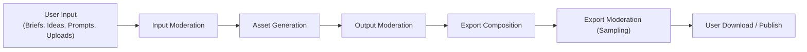

# Content Moderation And Safety

## Goals

- Prevent harmful or policy-violating content from being generated, stored, or exported by the platform.
- Operate moderation checks at platform boundaries rather than relying on provider-side filtering alone.
- Surface moderation decisions to users in clear, actionable terms without leaking sensitive classification details.
- Maintain an auditable record of moderation events separate from product analytics.

## Moderation Boundaries

### 1. Input Moderation

Applied to:

- project briefs and topic descriptions
- idea prompts and script prompts
- scene prompt pairs before image generation
- user-uploaded reference images or brand assets

### 2. Output Moderation

Applied to:

- generated start and end frame images before they are approved
- generated video clips before they enter the silent-clip normalization step
- generated narration audio when script drift is suspected

### 3. Export Moderation

Applied to a sample of completed exports before download is made available.

## Moderation Modes

| Mode | Description | Default |
| --- | --- | --- |
| `blocking` | Generation or export is blocked until moderation completes | Yes for input and output |
| `async_review` | Generation proceeds, human review queued in parallel | Optional for export sampling |
| `skip` | Moderation bypassed (operator override only, logged) | Never default |

## Provider-Level Safety

Most generation providers offer their own content filters. These are treated as a complementary layer, not a substitute for platform-level moderation.

## Moderation Provider Integration

The platform should integrate one configurable moderation provider through the same adapter pattern used for generation providers.

## Quarantine And Audit

- Quarantined assets remain in object storage under a separate prefix.
- Quarantine records are stored in the `moderation_events` table.
- Operators can release or permanently reject quarantined assets through the admin interface.

## User-Facing Messages

Moderation failure messages shown to users must:

- never expose classifier category labels
- offer a clear next action
- not expose which specific classifier or provider made the decision

## Implementation Phasing

| Phase | Moderation Work |
| --- | --- |
| Phase 1 | Input text moderation on briefs, ideas, and prompts |
| Phase 3 | Output moderation on frame pairs and generated video clips; quarantine model |
| Phase 4 | Operator review queue and audit trail |
| Phase 5 | Export sampling moderation |
| Phase 6 | User upload moderation when file upload is introduced |
