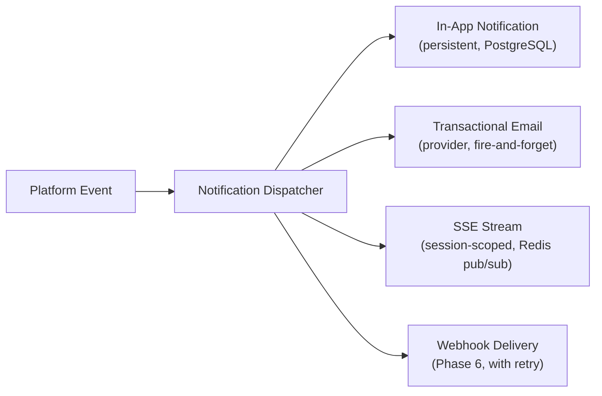

# Notifications And Webhooks

## Goals

- Alert users to meaningful workflow events without overwhelming them with noise.
- Provide reliable, trackable delivery across multiple channels.
- Support programmatic webhooks for advanced users and agency integrations from Phase 6 onward.
- Keep notification failures non-blocking: a failed notification must never affect the underlying workflow state.

## Notification Channels

| Channel | Available From | Description |
|---|---|---|
| In-app notification center | Phase 1 | Persistent bell icon with unread count |
| Transactional email | Phase 1 | Account and workflow-critical events |
| SSE render event stream | Phase 3 | Real-time render progress in the active browser session |
| Workspace webhook | Phase 6 | HTTP POST to a user-configured endpoint |

### Channel Relationship And SSE Distinction

The SSE render event stream (`GET /renders/{render_job_id}/events`) is a **session-scoped, real-time channel** for active render monitoring. It is not a general notification channel. Events in the SSE stream are transient: they exist only while the connection is open.

The in-app notification center and email channels are **persistent, delivery-guaranteed channels** for events that matter whether or not the user is actively on the page.

## SSE Fallback Strategy

SSE connections may drop due to proxy timeouts, load balancer idle timeouts, or network interruptions. The frontend must implement:

- **Automatic reconnect:** Reconnect on close with exponential backoff starting at 2 seconds, capped at 30 seconds.
- **Last-Event-ID header:** Use the browser's built-in `Last-Event-ID` mechanism. The server must replay events since the last received ID on reconnect, up to a configurable window (default: last 50 events per render job).
- **Polling fallback:** If SSE reconnect attempts fail after 3 tries, switch to polling `GET /renders/{render_job_id}` every 5 seconds. The polling client uses the same render status model; no separate polling endpoint is needed.
- **Stale detection:** If no SSE event is received for 30 seconds, trigger a poll to confirm the render is still progressing.

SSE events are buffered in Redis pub/sub channels keyed by render job ID. Events older than 10 minutes are not buffered — they are only accessible via the render job status endpoint.

## Notification Event Catalog

### Phase 1 Events

| Event | In-App | Email | Trigger |
|---|---|---|---|
| `workspace.member_invited` | ✅ | ✅ | A user is invited to a workspace |
| `workspace.member_joined` | ✅ | ❌ | Workspace owner sees a member accept |
| `generation.ideas_ready` | ✅ | ❌ | Idea generation job completes |
| `generation.script_ready` | ✅ | ❌ | Script generation job completes |
| `generation.failed` | ✅ | ✅ | Any planning generation job fails permanently |

### Phase 3 Events

| Event | In-App | Email | SSE | Trigger |
|---|---|---|---|---|
| `render.started` | ✅ | ❌ | ✅ | Render job created and queued |
| `render.step.completed` | ❌ | ❌ | ✅ | Individual render step succeeds |
| `render.step.failed` | ✅ | ❌ | ✅ | Individual render step fails |
| `render.paused_for_keyframe_review` | ✅ | ❌ | ✅ | All keyframes generated and awaiting review |
| `render.keyframe_review_reminder` | ✅ | ✅ | ❌ | 24h and 48h before keyframe review timeout |
| `render.moderation_blocked` | ✅ | ❌ | ✅ | A scene step blocked by output moderation |
| `render.completed` | ✅ | ✅ | ✅ | All steps complete, export ready |
| `render.failed` | ✅ | ✅ | ✅ | Render reaches terminal failure |
| `export.ready` | ✅ | ✅ | ✅ | Export download link available |

### Phase 6 Events

| Event | In-App | Email | Webhook | Trigger |
|---|---|---|---|---|
| `review.requested` | ✅ | ✅ | ✅ | Scene plan or export submitted for review |
| `review.approved` | ✅ | ✅ | ✅ | Reviewer approves a submission |
| `review.rejected` | ✅ | ✅ | ✅ | Reviewer rejects a submission |
| `comment.added` | ✅ | ❌ | ✅ | A comment is added to a project artifact |
| `member.role_changed` | ✅ | ✅ | ❌ | A workspace member's role is updated |

## Data Model

### `notification_events` Table

| Column | Type | Notes |
|---|---|---|
| `id` | UUID | Primary key |
| `workspace_id` | UUID | Workspace scope |
| `user_id` | UUID | Recipient user |
| `event_type` | Enum | See event catalog above |
| `reference_type` | String | e.g., `render_job`, `project` |
| `reference_id` | UUID | ID of the related object |
| `payload` | JSONB | Event-specific data |
| `read_at` | Timestamp | Null until read |
| `created_at` | Timestamp | Record creation |

### `webhook_deliveries` Table

| Column | Type | Notes |
|---|---|---|
| `id` | UUID | Primary key |
| `workspace_id` | UUID | Webhook owner |
| `event_type` | String | Event type |
| `endpoint_url` | String | User-configured target |
| `payload` | JSONB | Full event payload |
| `status` | Enum | `pending`, `delivered`, `failed`, `exhausted` |
| `attempts` | Integer | Delivery attempt count |
| `last_attempted_at` | Timestamp | Most recent attempt |
| `delivered_at` | Timestamp | Null until successfully delivered |

### `notification_preferences` Table

| Column | Type | Notes |
|---|---|---|
| `id` | UUID | Primary key |
| `user_id` | UUID | Preference owner |
| `event_category` | Enum | `render`, `billing`, `collaboration`, `workspace`, `system` |
| `email_enabled` | Boolean | Whether email delivery is active for this category |
| `in_app_enabled` | Boolean | Always true for critical categories; settable for others |
| `updated_at` | Timestamp | Last preference change |

## Email Delivery

- Transactional email is sent through an abstract `EmailProvider` interface, keeping the product logic independent of the email vendor (SendGrid, Postmark, Resend, etc.).
- Email failures are logged to `notification_events` with a `delivery_failed` status. Email failures must not block any upstream workflow state transition.
- All emails must include an unsubscribe link for non-critical notification types.

## Webhook Delivery

- Webhooks use HTTPS POST with a JSON payload and an HMAC-SHA256 signature header.
- Retry policy: up to 5 attempts with exponential backoff (1s, 5s, 30s, 5m, 30m).
- After 5 failed attempts, the delivery status is set to `exhausted` and the workspace owner is notified via in-app notification.
- Webhook endpoints must respond with HTTP 2xx within 10 seconds; otherwise the attempt is counted as failed.

## Notification Preferences

- Users can toggle email notifications per event category in their account settings via `PATCH /api/v1/notification-preferences`.
- In-app notifications for critical events (render failures, moderation blocks, billing alerts) are not suppressible.
- Workspace owners can configure which event types trigger webhook deliveries.
- Preference defaults: all email notifications enabled. Users must explicitly opt out.

## Implementation Phasing

| Phase | Work |
|---|---|
| Phase 1 | In-app notification center, email for invites and planning failures; `notification_preferences` stubs with defaults |
| Phase 3 | SSE stream with reconnect and polling fallback; render, keyframe review, moderation block, and export notifications |
| Phase 4 | `render.failed` in-app and email for permanent failures; operational alerts for unusual failure rates; active notification_preferences management |
| Phase 6 | Webhook delivery system, review workflow notifications |

