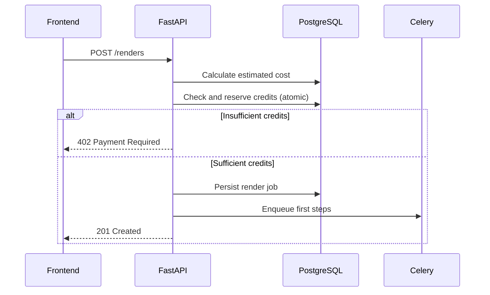

# Rate Limiting And Quota Enforcement

## Goals

- Protect platform economics by enforcing credit and usage limits before expensive generation begins.
- Prevent individual workspaces from monopolizing shared generation queue capacity.
- Degrade access gracefully when limits are hit: block the expensive operation without corrupting the user's project state.
- Make quotas transparent to users through the API and UI before they hit a limit, not only when blocked.

## Two Distinct Enforcement Layers

### Layer 1 — API Rate Limiting (Request Frequency)

Controls how many HTTP requests a workspace or user can make to the API within a time window. Protects the API server from abuse and bot traffic regardless of credit balance.

### Layer 2 — Credit And Usage Quota (Consumption Volume)

Controls how much total generation work a workspace can submit based on their subscription plan. Protects platform margin and provider cost.

Both layers operate independently. A workspace can be rate-limited without exhausting credits, and can exhaust credits without hitting the request rate limit.

## Layer 1 — API Rate Limiting

### Enforcement Point

Rate limiting is enforced at the reverse proxy / API gateway layer for unauthenticated routes (e.g., `/auth/login`), and at the FastAPI middleware layer for authenticated routes.

### Scoping

| Scope | Applies To |
|---|---|
| Per-IP | All unauthenticated endpoints |
| Per-user | Authenticated endpoints for user-specific actions |
| Per-workspace | Generation trigger endpoints and render creation |

### Limits By Endpoint Category

| Category | Window | Limit (default) | Notes |
|---|---|---|---|
| Auth endpoints | 1 minute | 10 requests | Per IP address |
| Read endpoints | 1 minute | 300 requests | Per workspace |
| Write endpoints (project, script edits) | 1 minute | 60 requests | Per workspace |
| Generation trigger endpoints | 1 minute | 10 requests | Per workspace |
| Render creation | 1 hour | 20 renders | Per workspace |
| Admin endpoints | 1 minute | 30 requests | Per authenticated admin user |

### Response Format

When a rate limit is exceeded, the API must return:

```
HTTP 429 Too Many Requests
Retry-After: <seconds>
X-RateLimit-Limit: <limit>
X-RateLimit-Remaining: 0
X-RateLimit-Reset: <unix timestamp>
```

Body:
```json
{
  "error": "rate_limit_exceeded",
  "message": "You have exceeded the request limit for this action. Please try again in {seconds} seconds.",
  "retry_after": 42
}
```

### Storage

Rate limit counters use Redis with TTL-based sliding window or fixed window counting. Redis is the only system of record for rate limiting state — no database writes for rate limit checks.

## Layer 2 — Credit And Usage Quota

### Credit Model

- Every workspace holds a credit balance in the `credit_ledger_entries` table.
- Credits are consumed when generation steps complete successfully—not when jobs are enqueued.
- In Phase 3 the platform records estimated usage units and actual provider cost for render and preview jobs, but it does not yet hard-enforce customer-visible credit reservations.
- Starting in Phase 4, credits are reserved (locked) when a render job is created, based on the estimated cost of the job. Reservation prevents double-spending under concurrent render conditions.
- Starting in Phase 4, reserved credits are settled (deducted) after each step succeeds or refunded if a step fails and is not retried.

### Credit Costs By Modality

Exact amounts are set by operator configuration, not hardcoded. Defaults:

| Operation | Credit Cost (unit: platform credits) |
|---|---|
| Idea generation (per set) | 1 |
| Script generation | 2 |
| Scene plan generation | 1 |
| Image generation (per scene) | 5 |
| Video generation (per scene) | 20 |
| Narration generation (per scene) | 3 |
| Music generation (per export) | 5 |
| FFmpeg composition (per export) | 2 |

### Pre-Flight Credit Check

Beginning in Phase 4, before a render job is created, the API must:
1. Calculate the estimated total credit cost for the job based on the scene count and selected generation modalities.
2. Check the workspace credit balance against the estimated cost.
3. If insufficient, return `HTTP 402 Payment Required` with the shortfall amount and a link to add credits.
4. If sufficient, atomically reserve the estimated credits and create the render job.



### Credit Ledger Rules

- Every deduction or addition is a separate immutable `credit_ledger_entry` row — the balance is always computed from the ledger, never stored as a denormalized column.
- Starting in Phase 4, reservations are also ledger entries with a `reserved` status.
- Starting in Phase 4, settlement converts `reserved` entries to `deducted`.
- Starting in Phase 4, refunds for failed steps create `refunded` entries.
- The current balance is `SUM(entries WHERE status IN (added, refunded)) - SUM(entries WHERE status = deducted)`.

### Plan-Based Quotas

Beyond per-operation credits, subscription plans impose monthly generation limits:

| Plan | Monthly Renders | Max Concurrent Renders | Max Scenes Per Render |
|---|---|---|---|
| Free | 3 | 1 | 8 |
| Creator | 30 | 3 | 20 |
| Pro | 200 | 10 | 50 |
| Studio | Unlimited | 30 | 100 |

Monthly quotas reset on the billing cycle date. Quota state is stored in the `subscriptions` table alongside the current billing period.

### Queue-Level Concurrency Controls

Celery queues enforce per-workspace concurrency limits through a Redis-based token bucket:

- When a generation step is dispatched, the worker acquires a workspace concurrency token from Redis.
- If no token is available (workspace is at its concurrency limit), the task is re-queued with a delay rather than rejected.
- Operators can lower workspace-level concurrency limits independently of the plan tier for abuse mitigation.

## Graceful Degradation

When a workspace hits a quota limit:

- Active render jobs that are already running continue to completion.
- New render job creation is blocked with `HTTP 402` or `HTTP 429` depending on whether the limit is credit-based or quota-based.
- Planning operations (brief, idea, script generation) are not blocked by render quotas unless the workspace is also credit-exhausted.
- Starting in Phase 4, the frontend usage summary must reflect current balance and quota position on every page load.

## Quota Visibility API

From Phase 4 onward, the HTTP response for every authenticated request must include headers:

```
X-Credits-Remaining: 142
X-Credits-Reserved: 60
X-Quota-Renders-Used: 7
X-Quota-Renders-Limit: 30
X-Quota-Reset: 2026-04-01T00:00:00Z
```

Additionally, a dedicated usage endpoint returns full quota state: `GET /usage`.

## Operator Controls

- Operators can manually adjust workspace credit balances via the admin API.
- Operators can override plan-level quota limits for specific workspaces.
- Operators can pause all generation for a specific workspace without blocking planning operations.
- Operator actions on credit balances must create audit ledger entries with `operator_adjustment` status.

## Implementation Phasing

| Phase | Work |
|---|---|
| Phase 1 | API rate limiting middleware; Redis counter setup |
| Phase 3 | Estimated usage-unit recording and provider-cost capture for renders and previews |
| Phase 4 | Full credit ledger, plan-based quotas, operator tooling, usage headers |
| Phase 5 | Queue-level concurrency controls; alert on unusual credit consumption |

