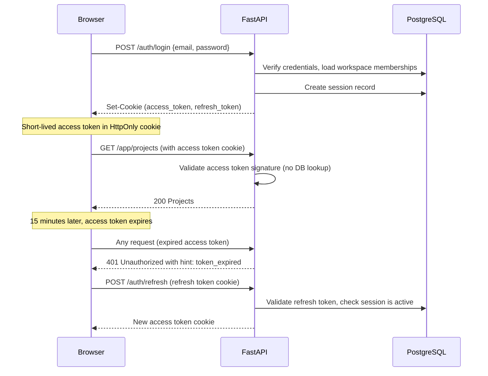

# Authentication And Identity

## Goals

- Provide secure, stateful authentication for all users of the web application.
- Issue identity tokens that carry workspace-scoped claims so authorization checks remain lightweight and local.
- Support future SSO and enterprise identity integrations without requiring a rewrite of the core auth model.
- Minimize attack surface by keeping session lifetimes short and requiring re-authentication for sensitive operations.

## Authentication Strategy

The platform uses **short-lived access tokens paired with longer-lived refresh tokens**, stored in HttpOnly cookies. This model avoids the XSS exposure of localStorage-stored JWT access tokens while providing sticky sessions that survive page refreshes.

| Token | Storage | Lifetime | Use |
|---|---|---|---|
| Access token | HttpOnly cookie | 15 minutes | Authenticate API requests |
| Refresh token | HttpOnly cookie | 30 days | Obtain new access tokens |
| Session record | PostgreSQL `sessions` table | 30 days | Audit and revocation |

Tokens are implemented as signed JWTs using RS256 (asymmetric signing). The private key is stored in the platform's secret manager. API services validate tokens using the corresponding public key without making a database call on every request.

## Token Claims

### Access Token Claims

```json
{
  "sub": "user-uuid",
  "email": "user@example.com",
  "workspace_id": "workspace-uuid",
  "workspace_role": "admin | member | viewer | reviewer",
  "session_id": "session-uuid",
  "iat": 1710000000,
  "exp": 1710000900
}
```

The `workspace_id` and `workspace_role` claims reflect the **currently active workspace** selected by the user. When a user switches workspaces, a new access token is issued with the updated workspace context. The refresh token remains valid across workspace switches.

### Multi-Workspace Users

A user may be a member of multiple workspaces. The access token carries one active workspace context at a time. The user selects their active workspace at session start or through the workspace switcher in the app shell.

On workspace switch, the frontend calls `POST /auth/workspace/select` with the target workspace ID. The server validates membership, issues a new access token with the updated workspace context, and returns it as a refreshed HttpOnly cookie.

## Authentication Flow



## Session Management

- Every login creates a row in the `sessions` table: `user_id`, `workspace_id`, `refresh_token_hash`, `user_agent`, `ip_address`, `created_at`, `last_used_at`, `expires_at`, `revoked_at`.
- The refresh token stored in the cookie is hashed before being stored in the database.
- On token refresh, the server updates `last_used_at` and issues a new access token.
- On logout, the session row's `revoked_at` is set. The refresh token cookie is cleared. The access token remains technically valid until it expires — this is acceptable given the 15-minute lifetime.
- Operators can revoke all sessions for a user or workspace via the admin API.

## Password Policy

- Minimum 12 characters, no maximum.
- Passwords are hashed using Argon2id.
- Password reset uses a time-limited token (1 hour) delivered via transactional email.
- Failed login attempts are rate-limited per email address: 5 failures within 10 minutes triggers a 15-minute lockout.

## Authorization Model

Authorization is separate from authentication. Once the access token is validated, route handlers defer to the service layer for permission checks.

### Permission Levels

| Role | Capabilities |
|---|---|
| `admin` | Full workspace control including billing, members, brand kits, and all project operations |
| `member` | Create and manage own projects, generate content, submit reviews |
| `reviewer` | View assigned projects, add comments, approve or reject submitted plans |
| `viewer` | Read-only access to projects, exports, and assets |

### Permission Check Pattern

Gateway pattern: route handlers call a permission helper before invoking business logic.

```python
# Example: service-layer permission guard
def require_workspace_role(user: User, workspace: Workspace, minimum_role: Role):
    if not workspace.has_role(user, minimum_role):
        raise PermissionDeniedError(
            user_id=user.id,
            workspace_id=workspace.id,
            required_role=minimum_role,
        )
```

Project-level ownership checks are performed in the project service: only the project owner or workspace admins can delete a project.

## API Key Authentication (Phase 6 Forward)

In Phase 6, workspace admins can create long-lived API keys for automation and webhook verification. API keys:
- Are generated with a `rg_` prefix for easy identification.
- Are stored as HMAC hashes — the plaintext is shown only once at creation.
- Carry the same workspace role as the creating user at the time of creation (role is frozen at key creation, not dynamically resolved).
- Can be revoked individually by workspace admins.
- Must not be usable for write operations if the workspace has outstanding billing issues.

## SSO Integration (Phase 6 — Enterprise Tier)

SSO is implemented as a separate integration boundary from the core username/password auth system:

- Supported protocol: SAML 2.0 and OIDC.
- SSO users are still provisioned as platform user records with a workspace membership.
- SSO tokens are exchanged for platform access tokens at login — the downstream auth model (JWT claims, HttpOnly cookies) is identical whether the user authenticated via password or SSO.
- SSO configuration is per-workspace and stored as an encrypted workspace configuration record.

## Security Requirements

- All auth endpoints must be served over HTTPS. Cookies must be `Secure`, `HttpOnly`, and `SameSite=Strict`.
- Access tokens must not be logged. Correlation IDs are logged instead.
- Refresh token rotation: every use of a refresh token issues a new refresh token (refresh token rotation). Detecting a reuse of an invalidated refresh token causes all sessions for that user to be revoked (refresh token theft mitigation).
- Auth endpoints must be excluded from workspace-level rate limiting but subject to stricter per-IP rate limiting.

## Implementation Phasing

| Phase | Auth Work |
|---|---|
| Phase 1 | Username/password auth, JWT access + refresh tokens, session table, workspace role claims |
| Phase 3 | Rate limiting on auth endpoints, session revocation admin tooling |
| Phase 6 | API keys, SSO integration boundary, workspace-level auth configuration |


