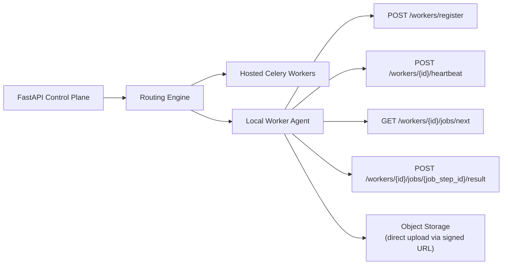

# Local Worker Agent Protocol

## Why This Document Exists

Phase 7 introduces local worker execution where users can register their own machines to process generation jobs. The protocol governing how local workers interact with the platform control plane must be designed now — during the hosted execution phases — so that:

1. The API surface is stable when Phase 7 arrives and no breaking changes are introduced.
2. The hosted Celery workers and future local workers share the same job execution contract, enabling the routing engine to treat them interchangeably.
3. Security trust boundaries are established before any external machine is allowed to process platform jobs.

## Architecture Overview



Local workers operate in a **pull model**: they poll for the next assigned job step rather than receiving pushed tasks. This avoids requiring the platform to maintain outbound connections to local machines and respects NAT and firewall constraints common in home or office environments.

## Registration Handshake

### Endpoint

`POST /api/v1/workers/register` (stub available from Phase 3, implemented in Phase 7)

### Request

```json
{
  "workspace_id": "uuid",
  "display_name": "Studio Mac Pro",
  "capabilities": {
    "modalities": ["image", "video", "tts"],
    "providers": [
      {
        "modality": "image",
        "provider_id": "flux-local",
        "model_id": "flux-dev",
        "max_concurrent": 2
      },
      {
        "modality": "video",
        "provider_id": "wan2-local",
        "model_id": "wan2.1-i2v-480p",
        "max_concurrent": 1
      },
      {
        "modality": "tts",
        "provider_id": "xtts-local",
        "model_id": "xttsv2",
        "max_concurrent": 4
      }
    ],
    "hardware": {
      "gpu": "NVIDIA RTX 4090",
      "vram_gb": 24,
      "ram_gb": 64
    }
  },
  "agent_version": "1.0.0"
}
```

### Authentication

Registration requests must include a workspace-scoped API key (introduced in Phase 6). The API key binds the local worker to a specific workspace and its routing policies.

### Response

```json
{
  "worker_id": "uuid",
  "registration_token": "wk_<random>",
  "heartbeat_interval_seconds": 30,
  "heartbeat_endpoint": "/api/v1/workers/{worker_id}/heartbeat",
  "poll_endpoint": "/api/v1/workers/{worker_id}/jobs/next",
  "registered_at": "2026-03-19T04:48:53Z"
}
```

The `registration_token` is the credential the local worker uses for all subsequent calls. It is scoped to the specific worker ID and cannot be used as a general workspace API key.

## Heartbeat Protocol

Local workers must send a heartbeat every `heartbeat_interval_seconds` to remain active.

### Endpoint

`POST /api/v1/workers/{worker_id}/heartbeat`

### Request

```json
{
  "status": "idle | busy | draining",
  "active_step_ids": ["step-uuid-1"],
  "queue_depth": 0,
  "error_count_since_last_heartbeat": 0
}
```

### Heartbeat Failure Behavior

| Condition | Platform Response |
|---|---|
| No heartbeat within 3× interval | Worker marked `stale` — no new steps dispatched |
| No heartbeat within 10× interval | Worker marked `offline` — active steps are reassigned |
| Worker comes back online | Worker re-registers; in-progress steps must not be double-executed |

### Step Reassignment

When a local worker goes offline with active steps:
1. The orchestration service marks the affected render steps as `failed` with reason `worker_lost_contact`.
2. If the step is retryable, it is re-queued for the next available worker (hosted or another local worker matching the capability requirement).
3. If the step is not retryable, the render job is transitioned to `failed` and the user is notified.

## Job Pickup Contract

### Endpoint

`GET /api/v1/workers/{worker_id}/jobs/next?modality=image`

Local workers poll for the next assigned step for a given modality. The routing engine pre-assigns steps to workers based on workspace routing policy and worker capabilities.

### Response (step available)

```json
{
  "step_id": "uuid",
  "render_job_id": "uuid",
  "step_type": "image_generation",
  "modality": "image",
  "provider_id": "flux-local",
  "model_id": "flux-dev",
  "input": {
    "prompt": "...",
    "negative_prompt": "...",
    "width": 576,
    "height": 1024,
    "seed": 42,
    "reference_image_url": "signed-s3-url"
  },
  "output_upload_url": "signed-s3-put-url",
  "output_asset_key": "workspace/x/project/y/assets/images/scene-3.png",
  "deadline_seconds": 300,
  "assigned_at": "2026-03-19T04:48:53Z"
}
```

### Polling Interval

Workers should poll with exponential backoff when no job is available: 1s, 2s, 4s, 8s, up to a max of 30s. When the worker transitions to `busy`, polling for the same modality should stop until the active step completes.

## Job Result Reporting

### Endpoint

`POST /api/v1/workers/{worker_id}/jobs/{step_id}/result`

### Success Payload

```json
{
  "status": "completed",
  "output_asset_key": "workspace/x/project/y/assets/images/scene-3.png",
  "duration_seconds": 47.3,
  "provider_metadata": {
    "model_id": "flux-dev",
    "seed_used": 42,
    "vram_peak_gb": 18.2
  },
  "cost_estimate": null
}
```

For local workers, `cost_estimate` is null — cost accounting for local workers tracks compute time rather than monetary cost.

### Failure Payload

```json
{
  "status": "failed",
  "error_code": "out_of_vram",
  "error_message": "CUDA out of memory during image generation",
  "is_retryable": true,
  "duration_seconds": 12.1
}
```

Retryable local failures may be re-routed to a hosted provider by the routing engine depending on workspace policy.

## Asset Upload Protocol

Local workers must not upload assets through the FastAPI control plane. All binary assets are uploaded directly to object storage via **pre-signed PUT URLs** provided in the job pickup response:

1. Worker receives `output_upload_url` (a signed S3 PUT URL, valid for `deadline_seconds`).
2. Worker generates the asset locally.
3. Worker uploads directly to the signed URL.
4. Worker reports job result with the `output_asset_key`.

This prevents the control plane from becoming a media upload bottleneck and keeps large binary transfers off the API server.

## Trust Boundaries

| Boundary | Rule |
|---|---|
| Workspace isolation | A local worker can only receive job steps belonging to its registered workspace |
| Credential scope | The registration token cannot be used for any operation other than heartbeat, job poll, and job result reporting |
| Asset access | Signed URLs are scoped to the specific asset key and expire at the step deadline |
| Provider credentials | Local workers never receive platform-managed API keys for hosted providers. They use locally installed model weights only |
| Worker identity verification | Registration tokens are rotated if a worker re-registers. Old tokens are immediately invalidated |

## Capability Mismatch Handling

If the routing engine assigns a step to a local worker but the step's generation parameters exceed the worker's declared capabilities (e.g., resolution exceeds VRAM capacity):

1. The worker returns a failure with `error_code: capability_mismatch`.
2. The orchestration layer reassigns the step to a capable worker or falls back to a hosted provider.
3. Repeated capability mismatch from a worker causes the routing engine to update the worker's effective capability record and stop routing that step type to it.

## Eviction Policy

Workers are evicted from the registry under these conditions:
- Worker has been `offline` for more than 7 days.
- Workspace admin revokes the worker registration via the admin UI.
- Workspace API key used for registration is revoked.

Evicted workers must re-register to receive new steps. Eviction does not delete historical provider run records — they remain for audit and usage history.

## Implementation Phasing

| Phase | Work |
|---|---|
| Phase 3 | Stub `POST /api/v1/workers/register` and related endpoints returning `501 Not Implemented` |
| Phase 4 | Design routing engine interfaces with local worker as a passthrough capability |
| Phase 7 | Full implementation: registration, heartbeat, job poll, result reporting, routing integration, admin UI |


