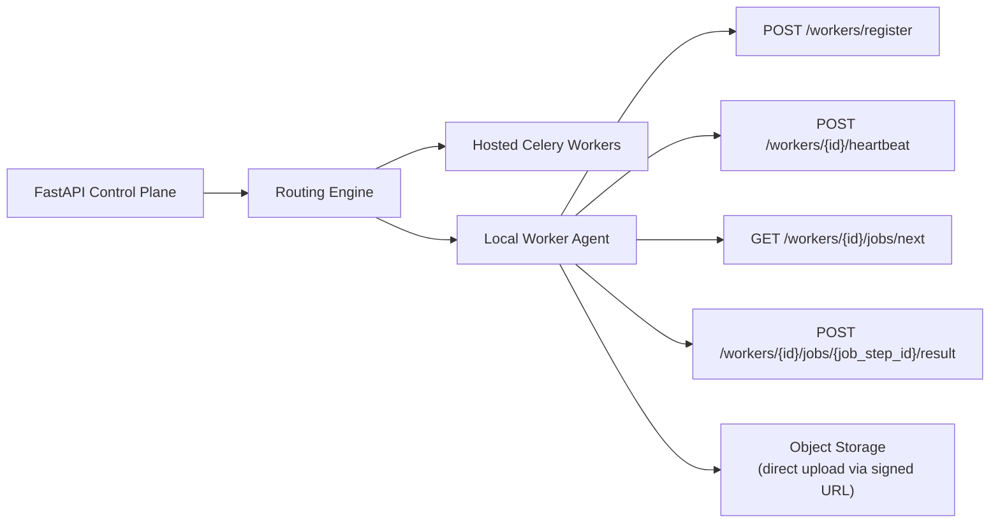

# Local Worker Agent Protocol

## Why This Document Exists

Phase 7 introduces local worker execution where users can register their own machines to process generation jobs. The protocol must already be compatible with:

- chained scene frame generation
- first/last-frame video generation
- silent-clip normalization metadata

## Architecture Overview

## Registration Handshake

Registration requests include a workspace-scoped API key and capability metadata. Capability metadata should declare whether the worker supports:

- image generation with ordered references
- video generation with first and last frames
- TTS
- clip retiming or FFmpeg post-processing

## Job Pickup Contract

The job pickup response may include:

- `start_frame_url`
- optional `end_frame_url`
- `prompt`
- `negative_prompt`
- `duration_seconds`
- `output_upload_url`

Video steps must state whether the platform expects a silent clip or whether the worker should report `has_audio_stream` for later stripping.

## Job Result Reporting

Success payloads should include:

- `status`
- `output_asset_key`
- `duration_seconds`
- `provider_metadata`
- `has_audio_stream` where relevant

Failure payloads should include:

- `status`
- `error_code`
- `error_message`
- `is_retryable`
- `duration_seconds`

## Asset Upload Protocol

Local workers must not upload assets through the FastAPI control plane. All binary assets are uploaded directly to MinIO-compatible object storage via pre-signed URLs.

## Trust Boundaries

- Workspace isolation
- Credential scope
- Asset access via signed URLs only
- No hosted provider credentials on local workers
- Worker identity verification and token rotation

## Capability Mismatch Handling

If a step requires first/last-frame generation or ordered reference inputs that the worker does not support, the worker must return `capability_mismatch` and the orchestration layer reroutes the step.

## Implementation Phasing

| Phase | Work |
| --- | --- |
| Phase 3 | Stub worker endpoints returning `501 Not Implemented` |
| Phase 4 | Design routing engine interfaces with local worker as a capability slot |
| Phase 7 | Full implementation with registration, heartbeat, job poll, result reporting, and routing integration |
