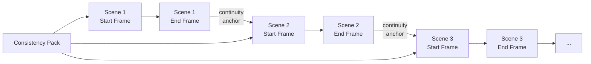

# Scene Frame Pair And Reference Chain

## Why This Document Exists

The platform no longer treats a scene as a single approved keyframe followed by image-to-video. The canonical scene unit is now a **frame pair**: one approved start frame and one approved end frame. The visual continuity rule also changed: later scenes inherit the prior scene's approved end frame as a continuity anchor.

This document is the definitive reference for the paired-frame model and cross-scene reference chaining.

---

## Canonical Scene Generation Rule

### Scene 1

1. Generate the **start frame** from the consistency pack and the scene's `start_image_prompt`.
2. Generate the **end frame** using scene 1's start frame as visual reference, plus the consistency pack and the scene's `end_image_prompt`.

### Scene N (N > 1)

1. Generate the **start frame** using scene N-1's **completed end frame** as the continuity anchor, plus the consistency pack and the scene's `start_image_prompt`.
2. Generate the **end frame** using scene N's start frame as visual reference, plus the consistency pack and the scene's `end_image_prompt`.

### Chain Diagram

---

## Why The Chain Matters

Without it:

- Scenes may each look internally good but adjacent scenes fail to feel like the same character, lighting setup, or world state.
- Visual drift accumulates over 8–16 segments and is obvious in the final export.

With it:

- The user gets both **global consistency** from the pack and **local continuity** from the prior end frame.
- Smooth cross-scene transitions become achievable because the end of one scene visually leads into the start of the next.

---

## Data Model Requirements

Each `scene_segment` row must include:

| Field | Type | Description |
|---|---|---|
| `start_image_prompt` | Text | Prompt for the opening frame |
| `end_image_prompt` | Text | Prompt for the closing frame |
| `start_image_asset_id` | UUID | Reference to the generated start frame asset |
| `end_image_asset_id` | UUID | Reference to the generated end frame asset |
| `chained_from_asset_id` | UUID | Previous scene's end frame asset (null for scene 1) |

Each asset involved in the chain tracks lineage:

| Field | Type | Description |
|---|---|---|
| `parent_asset_id` | UUID | The asset this was derived from (chain parent) |
| `asset_role` | Enum | `scene_start_frame`, `scene_end_frame`, `continuity_anchor` |

---

## Prompt Assembly Per Frame

Each frame generation request assembles its prompt in a fixed order:

| Order | Component | When Used |
|---|---|---|
| 1 | Global prompt prefix (from consistency pack) | Always |
| 2 | Continuity anchor reference image | Scene N > 1 start frames only |
| 3 | Within-scene reference image | End frames only (references start frame) |
| 4 | Scene narration context (sub-script text) | Always |
| 5 | Frame-specific prompt (`start_image_prompt` or `end_image_prompt`) | Always |
| 6 | Style descriptor (from visual preset) | Always |
| 7 | Camera and framing instruction | Always |
| 8 | Negative prompt (from consistency pack) | Always |

---

## Frame-Pair Review

Frame-pair review happens **after** all scene images are generated and **before** video generation begins. Users can:

| Action | Effect |
|---|---|
| **Approve pair** | Both frames locked. Video generation proceeds for this scene. |
| **Regenerate start frame** | New start frame generated. End frame must also be regenerated. |
| **Regenerate end frame** | New end frame generated. Downstream scenes flagged as stale. |
| **Regenerate both** | Full pair regenerated. Downstream scenes flagged. |
| **Replace frame (upload)** | User-uploaded image replaces generated frame. Dependent frames flagged as applicable. |
| **Approve all** | Batch approval of all pairs. |

### Staleness Propagation

When a scene's end frame is regenerated or replaced:

1. All downstream scenes that chained from the old end frame are marked **stale**.
2. Stale scenes display a warning in the review UI showing the chain break.
3. The user can regenerate stale scenes' start frames with the new chain reference, or accept them as-is (reduced visual continuity).

---

## Parallelism Constraints

| Can Run In Parallel | Must Be Sequential |
|---|---|
| Narration generation (independent of image chain) | Start frame of scene N depends on end frame of scene N-1 |
| Music preparation | Image generation across scenes |
| Video generation for scene N while images generate for scene N+2 | Frame pair approval before video generation |
| Start/end frames within a scene (with within-scene reference) | |

**Impact:** Image generation render time is O(n) linear across scenes, not O(1) parallel. Mitigation: pipeline video generation behind image generation — start generating video for approved scenes while images for later scenes are still in progress.

---

## Provider Compatibility

| Provider Capability | Preferred Path | Degraded Path |
|---|---|---|
| FLF2V (first/last frame video) | Pass both start + end frames | ✅ Preferred |
| I2V only (single frame video) | Pass start frame only; end frame used for chain only | ⚠️ Degraded |
| T2V only (text-to-video) | Text prompt only | ❌ Lowest quality fallback |

The selection chain: FLF2V → I2V → T2V. The adapter layer logs which mode was used.

---

## Failure Rules

| Failure | Response |
|---|---|
| Missing prior end frame | Block the next chained frame generation step. Surface the break point. |
| Invalidated downstream scenes | Explicit stale state, never silently reused. |
| Provider lacks reference-image support | Capability mismatch error, reroute if possible. |
| Chain break (unrecoverable upstream failure) | Generate next scene from consistency pack only. Record chain break in metadata. Allow render to proceed with reduced continuity. |

---

## API Endpoints Required

| Endpoint | Purpose |
|---|---|
| `POST /scenes/{id}/prompt-pairs` | Generate start/end image prompts for a scene segment |
| `POST /scenes/{id}/generate-frame-pair` | Generate the paired start + end frame images |
| `POST /scenes/{id}/approve-frame-pair` | Approve a scene's frame pair for video generation |
| `POST /scenes/{id}/regenerate-start-frame` | Regenerate start frame (invalidates end frame) |
| `POST /scenes/{id}/regenerate-end-frame` | Regenerate end frame (flags downstream as stale) |
| `GET /renders/{id}/frame-pairs` | Get all frame pairs for a render job's review surface |

---

## Implementation Phasing

| Phase | Work |
|---|---|
| Phase 2 | Prompt-pair authoring and storage; `start_image_prompt` and `end_image_prompt` fields on scene segments |
| Phase 3 | Frame-pair generation, cross-scene reference chaining, frame-pair review gate, FLF2V video generation |
| Phase 5 | Reusable prompt-pair templates, lineage views, and visual continuity scoring across frame pairs |
