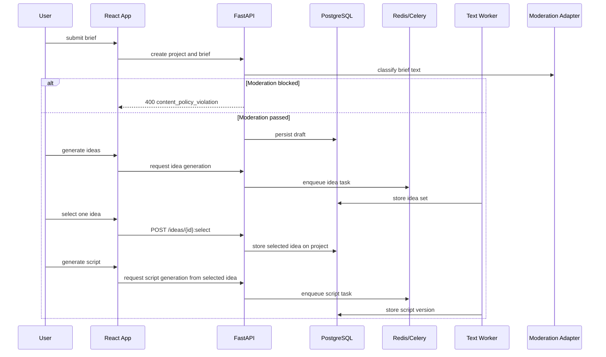

# Phase 1 Architecture

## Components Introduced

- Auth and workspace modules
- Project and brief modules
- Idea and script generation services
- Idea selection state on projects
- Text generation adapter
- Input moderation adapter
- API rate limiting middleware
- Visual consistency pack schema placeholder
- Initial job creation and worker dispatch
- Frontend dashboard, idea selection, and script workspace

## Flow

## Data Changes

- Add `users`, `sessions`, `workspaces`, `workspace_members`, `projects`, `project_briefs`, `idea_sets`, and `script_versions`.
- Add selected-idea state on `projects`.
- Add the full `render_jobs` and `render_steps` schema in Phase 1 even though only planning-tier tasks use it initially.
- Add initial `consistency_packs` table with required columns even if empty in Phase 1.

## API Surface Added

- Auth and session routes
- Workspace CRUD and membership invitation stubs
- Project CRUD
- Brief create and update
- Idea generation endpoint
- Idea selection endpoint
- Script generation endpoint
- Script draft save, fetch, and patch

## Frontend Structure

- Auth screens
- Dashboard
- Project creation wizard
- Brief editor
- Idea selection surface
- Script editor

## Failure And Recovery

- Text generation failure must leave the project draft intact.
- Users must be able to rerun generation without losing manual edits.
- Worker failures should be visible in project history.
- Moderation failures must block unsafe generation without corrupting the project draft.
