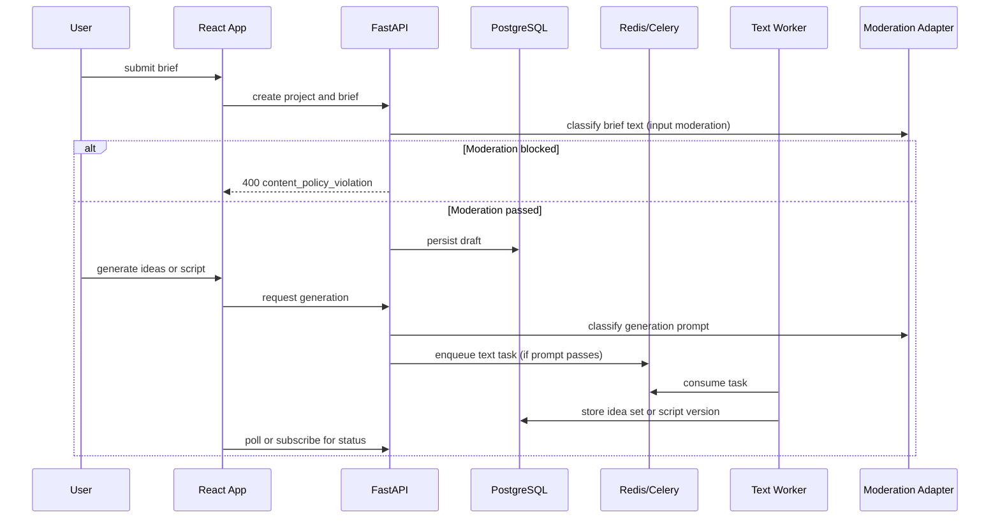

# Phase 1 Architecture

## Components Introduced

- Auth and workspace modules
- Project and brief modules
- Idea and script generation services
- Text generation adapter
- Input moderation adapter
- API rate limiting middleware
- Visual consistency pack schema (defined but not yet enforced)
- Initial job creation and worker dispatch
- Frontend dashboard and script workspace

## Flow

## Data Changes

- Add `users`, `sessions`, `workspaces`, `workspace_members`, `projects`, `project_briefs`, `idea_sets`, and `script_versions`.
- **Add the full `render_jobs` and `render_steps` schema in Phase 1** even though only planning-tier tasks use it initially. Planning jobs (idea generation, script generation) are modeled as render jobs with a `job_type` of `planning` to avoid a breaking schema migration when Phase 3 render jobs are introduced. This decision prevents introducing a separate planning job table that would require reconciliation later.
- Add initial `consistency_packs` table with required columns even if empty in Phase 1, so Phase 2 and Phase 3 can populate it without migrations.
- Store prompt template version and provider metadata for generated ideas and scripts.
- Add Redis rate limit counters (`ratelimit:{workspace_id}:{endpoint_group}`) keyed with TTL — no database writes for rate limit state.

## API Surface Added

- Auth and session routes
- Workspace CRUD and membership invitation stubs
- Project CRUD
- Brief create and update
- Idea generation endpoint
- Script generation endpoint
- Script draft save, fetch, and patch
- Reserve the `/api/v1/workers/*` namespace in the API design; public stub endpoints are first exposed in Phase 3 and fully implemented in Phase 7
- Request-level rate limiting headers on rate-limited responses (`Retry-After`, `X-RateLimit-Limit`, `X-RateLimit-Remaining`, `X-RateLimit-Reset`)
- `GET /api/v1/notification-preferences` and `PATCH /api/v1/notification-preferences` — stubs returning defaults in Phase 1, fully managed from Phase 3

## Frontend Structure

- Auth screens
- Dashboard
- Project creation wizard
- Brief editor
- Idea selection surface
- Script editor

## Failure And Recovery

- Text generation failure must leave the project draft intact.
- Users must be able to rerun generation without losing manual edits.
- Worker failures should be visible in project history.
- Moderation failures must block unsafe generation without corrupting the project draft.
