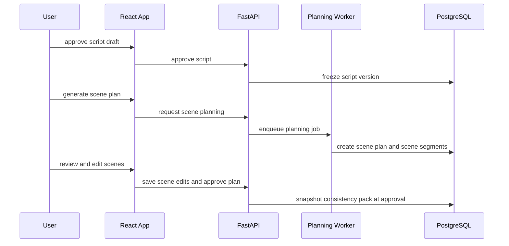

# Phase 2 Architecture

## Components Added

- Segmentation and timing service
- Scene planning service
- Visual preset and voice preset services
- Consistency pack initialization service
- Approval status transitions for script and scene plan records
- Scene planning UI and preset management screens

## Flow

## Duration Estimation

Scene duration estimation uses a two-tier approach:

1. **Word-count heuristic (default):** Estimated duration in seconds = `word_count / 2.2`, which corresponds to approximately 130 words per minute — a standard adult narration pace. This is computed before any TTS has run.
2. **TTS timing override:** If a narration dry-run is available (Phase 3+), the measured audio duration replaces the heuristic estimate for any scene where narration has been generated.

Timing warnings surface to users in the scene editor:
- Warning if an estimated segment duration exceeds 10 seconds (hard limit).
- Warning if total script duration falls outside 25–65 seconds.
- These warnings are advisory — they do not block approval.

## Data Changes

- Add `scene_plans` and `scene_segments`.
- Add `visual_presets` and `voice_presets`.
- Add approval timestamps and approval actor fields to scripts and scene plans.
- Initialize `consistency_packs` record when a scene plan is approved: snapshot character sheet, style descriptor, prompt prefix, and negative prompt from the selected visual preset.

## API Surface Added

- Segment script endpoint
- Generate scene plan endpoint
- Scene plan fetch and update
- Script approve endpoint (freezes script version as immutable)
- Scene plan approve endpoint (triggers consistency pack snapshot)
- Preset CRUD endpoints

## Frontend Structure

- Scene timeline or ordered list workspace
- Scene editor panel with duration estimate display
- Visual preset picker
- Voice preset picker
- Approval action surfaces

## Risk Controls

- Manual edits must override generated scene suggestions cleanly.
- Approved records are immutable inputs to later renders. Creating a new draft is always permitted, but it requires an explicit re-approval to become the active version.
- Timing estimates must be surfaced as transparent advisory warnings, not blocking validation, so users understand the 5–10 second scene constraints without being prevented from continuing.

