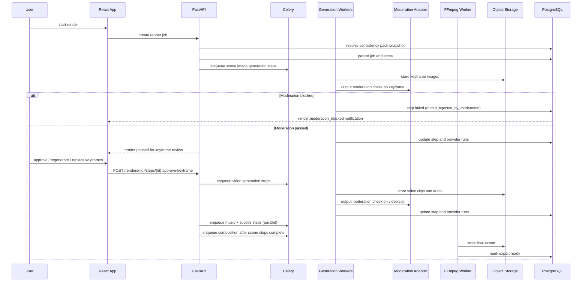

# Phase 3 Architecture

## Components Added

- Render orchestration service
- Render job and render step models (promoted from planning-tier stubs in Phase 1)
- Image generation adapter
- Video generation adapter (prefers image-to-video when keyframe is available)
- Speech generation adapter
- Music step service (curated track selection)
- Composition and export worker (FFmpeg-based, with A/V sync, music ducking, and loudness normalisation)
- Consistency pack resolution and enforcement
- Keyframe review gate (pauses job between image and video generation)
- Preview render mode (single-scene full pipeline)
- Export library UI and render monitor

> Audio-visual consistency strategy for the final merged export is fully specified in `14-composition-and-av-consistency.md`.

## Flow

## Preview Render Flow

A single-scene preview render follows the same pipeline — image generation, keyframe review, video generation, narration, composition — but targets only the selected scene segment. The output is a short clip stored as an `export` asset with `export_type: preview`. Preview renders record the same usage units that later map to the credit model, but customer-visible credit reservation and enforcement begin in Phase 4. A preview export can be promoted: if the user starts a full render on the same approved scene plan, the previously completed preview assets are reused (not regenerated) for the matching scene.

## Data Changes

- Promote `render_jobs` and `render_steps` from planning-tier stubs to full render models.
- Add `provider_runs`, `assets`, `asset_variants`, and `exports` tables.
- Add `consistency_pack_snapshot_id` to `render_jobs` — each job is permanently bound to the consistency pack that existed at creation time.
- Add `keyframe_approved_at` and `keyframe_approved_by` to render steps.
- Add `export_type` column to `exports`: `full`, `preview`.
- Record final export settings, resolution, aspect ratio, file size, loudness level, and codec as export metadata.
- Add `voice_preset_id` snapshot to render jobs — frozen at creation so all narration steps in the job use the same voice.

## API Surface Added

- `POST /api/v1/projects/{project_id}/renders` — create full render job
- `POST /api/v1/projects/{project_id}/renders?scene_id=X&mode=preview` — create preview render
- `GET /api/v1/renders/{render_job_id}` — render status
- `POST /api/v1/renders/{render_job_id}:cancel`
- `POST /api/v1/renders/{render_job_id}/steps/{step_id}:retry`
- `POST /api/v1/renders/{render_job_id}/steps/{step_id}:approve-keyframe`
- `POST /api/v1/renders/{render_job_id}/steps/{step_id}:regenerate-keyframe`
- `POST /api/v1/renders/{render_job_id}/steps/{step_id}:replace-keyframe`
- `GET /api/v1/projects/{project_id}/exports`
- `GET /api/v1/exports/{export_id}`
- `POST /api/v1/assets/{asset_id}/signed-url`
- `GET /api/v1/renders/{render_job_id}/events` — SSE stream
- `DELETE /api/v1/admin/users/{user_id}/sessions` — admin session revocation (auth doc phasing: Phase 3)

## Frontend Structure

- Render creation modal with preview mode option
- Keyframe review surface (approve per scene, regenerate, upload replacement)
- Render status timeline with per-scene step breakdown
- Asset preview surfaces
- Export library with preview vs. full export distinction

## Risk Controls

- Consistency pack must be fully resolved before any generation step dispatches. If the consistency pack is incomplete, the render job creation fails with `consistency_pack_required`.
- Generated visual and video assets must pass output moderation before they can move to approval or composition.
- Do not hide provider variability from users; show explicit failure states and retries.
- Keep the output format narrow in this phase (9:16 only).
- Store enough metadata to debug timing mismatches, provider failures, and export corruption.

