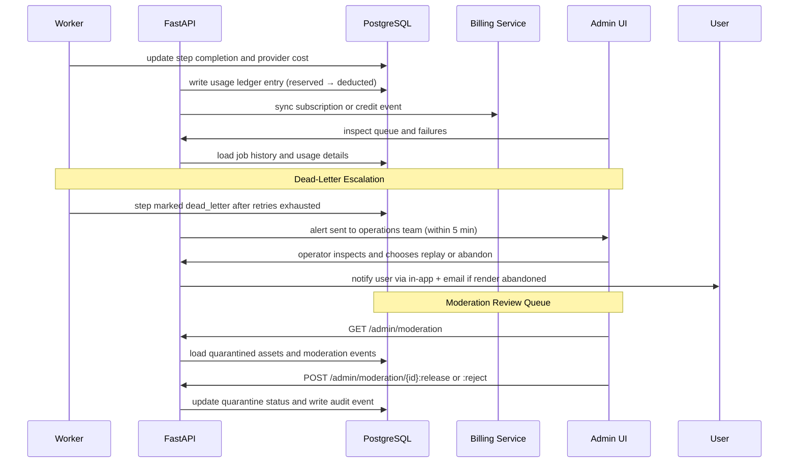

# Phase 4 Architecture

## Components Added

- Usage and billing service
- Enhanced render step checkpointing
- Dead-letter or failed-step review tooling
- Moderation review queue and operator release/reject workflow
- Admin operations views
- Reconciliation jobs for usage and billing consistency
- User-facing notification service for permanent render failures (via in-app and email)

## Flow

## Data Changes

- Add `credit_ledger_entries`, `subscriptions`, and operational metadata fields.
- Extend `provider_runs` with normalized cost, currency, and request identifiers.
- Extend `render_steps` with retry history and recovery source references.
- Add `moderation_events` table with quarantine status, operator decision, and audit timestamps.
- Extend `notification_events` with `render.failed` event type delivery records.
- Add `dead_letter_entries` reference in render step metadata including failure classification and retry exhaustion reason.

## API Surface Added

- `GET /api/v1/usage` — workspace usage summary
- `GET /api/v1/billing/subscription` — current plan and billing status
- `POST /api/v1/billing/checkout` and `POST /api/v1/billing/portal`
- Credit and invoice management endpoints
- `GET /api/v1/admin/moderation` — operator moderation review queue
- `POST /api/v1/admin/moderation/{moderation_event_id}:release` — approve quarantined asset
- `POST /api/v1/admin/moderation/{moderation_event_id}:reject` — permanently quarantine asset
- `GET /api/v1/admin/renders` and render inspection endpoints
- `POST /api/v1/admin/renders/{render_job_id}:replay` — replay a dead-letter step
- Usage headers on all authenticated responses: `X-Credits-Remaining`, `X-Credits-Reserved`, `X-Quota-Renders-Used`, `X-Quota-Renders-Limit`, `X-Quota-Reset`

## Frontend Structure

- Usage and billing pages with credit balance and quota position
- Render history with richer failure details and retry actions
- Internal admin queue and failure inspection views
- Moderation review queue for operators with release and reject actions

## Risk Controls

- Billing state must not depend on only one provider callback. Reconciliation run hourly must catch unpaid-for generation.
- Usage records must be idempotent and reconcilable. Credit ledger entries are immutable — corrections are new entries.
- Recovery tooling should not allow invalid state transitions or duplicate charges.
- Moderation release actions must be logged as audit events with the operator identity and timestamp.
- User notifications for permanent render failure must be delivered even if the billing sync has not yet settled.

