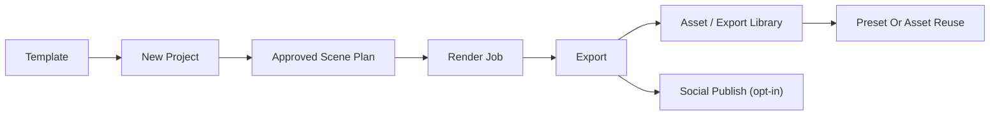

# Phase 5 Architecture

## Components Added

- Template service and cloning engine
- Asset library views and search
- Subtitle styling and export refinement logic
- Prompt history lineage views
- Audio polish utilities
- Music provider adapter for AI-generated tracks
- Social publish integration stub

## Flow

## Data Changes

- Add `project_templates` and `template_versions` records.
- Extend `assets` and `exports` with library metadata and reuse markers.
- Store prompt history and lineage references from generated outputs back to approved inputs.
- Extend subtitle and audio settings on exports or render profiles.
- Add `music_source_type` column to render job settings: `curated`, `generated`, `uploaded`.
- Add `social_publish_targets` table for tracking publish attempts and their status.

## API Surface Added

- `GET /api/v1/templates` and `POST /api/v1/templates`
- `POST /api/v1/templates/{template_id}:clone`
- Asset library list and search
- Prompt history retrieval
- Subtitle and export style configuration endpoints
- `POST /api/v1/exports/{export_id}:publish` — initiate social publish to a connected account
- `GET /api/v1/social/accounts` — list connected OAuth accounts for publishing

## Social Publish Integration

Phase 5 introduces social publishing as an opt-in connection:

- **Supported platforms (stub):** TikTok (TikTok Content Posting API) and Instagram Reels (Instagram Graph API).
- Users connect their accounts via OAuth from workspace settings. The OAuth token is encrypted at rest.
- Publish attempts are tracked in `social_publish_targets` with status (pending, published, failed) and the platform's assigned post ID on success.
- Publish failures do not delete the export. Users can retry the publish without re-rendering.
- This feature is a stub in Phase 5 — the integration surface is in place but full edge-case handling and account management expand in Phase 6.

## Frontend Structure

- Template library page with gallery view
- Asset and export history browser with filter and search
- Subtitle styling controls and preview
- Reuse actions from prior projects with lineage indicators
- Social publish action from export library

## Risk Controls

- Reuse features must preserve lineage so creators understand what was copied and what was regenerated.
- Extra polish controls should not turn the UI into a full non-linear editor. Features that would require timeline-level editing are explicitly out of scope.
- Template cloning must strip workspace-specific secrets and preset references that are not transferable.
- Social publish must be clearly labeled as a convenience feature — the platform is the creation system, not the channel management system.

