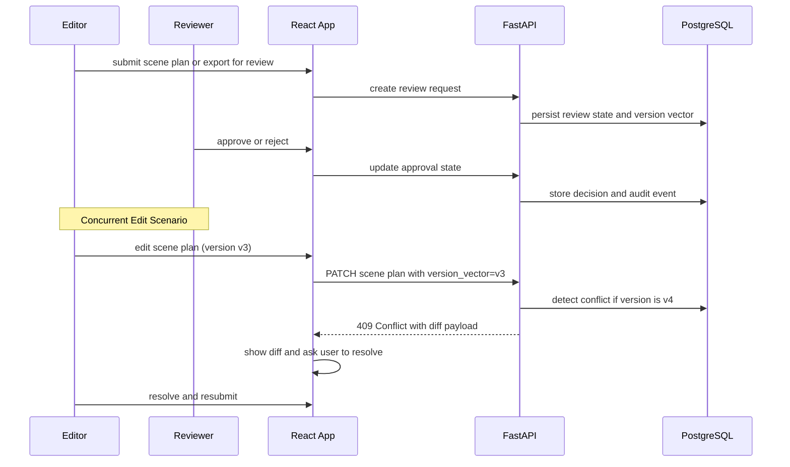

# Phase 6 Architecture

## Components Added

- Role and permission expansion
- Brand kit service
- Review and approval services
- Comment and annotation system
- Audit event expansion
- Conflict resolution model for concurrent edits

## Flow

## Conflict Resolution Model

Scene plan edits use **optimistic locking with version vectors**:

- Every mutable collaborative record (scene plan, script draft, preset) carries a `version` integer field.
- When a user saves an edit, the client submits the `version` it last read.
- The API compares the submitted version against the database version:
  - If they match, the edit is accepted and the version counter is incremented.
  - If they differ (another user edited in the meantime), the API returns `HTTP 409 Conflict` with a diff payload showing the conflicting changes.
- The frontend presents the conflict diff to the user and requires explicit resolution before the save is retried.
- Conflict resolution is **always user-driven** — the system never auto-merges scene plan content.

## Data Changes

- Extend workspace membership roles.
- Add `brand_kits`, `comments`, `review_requests`, and richer `audit_events`.
- Add approval history on exports, scene plans, or templates where needed.
- Add `version` integer column to collaborative records (scene plans, script drafts, presets).
- Extend `social_publish_targets` (introduced Phase 5) with `token_status` field and OAuth refresh token encrypted storage, enabling reconnect-required detection and publish analytics columns.

## API Surface Added

- Brand kit CRUD
- Review request create and resolve (`POST /reviews`, `POST /reviews/{id}:approve`, `POST /reviews/{id}:reject`)
- Comments create, list, and resolve
- Expanded membership and role management endpoints
- Conflict reporting via `HTTP 409` on PATCH operations for versioned records

## Frontend Structure

- Team settings pages with role assignment
- Review queues for pending approvals
- Comment threads or annotations on scene plans and exports
- Brand kit management UI
- Conflict resolution diff view

## Risk Controls

- Collaboration features must not break the simple solo-creator path. Solo users must not encounter review workflows or conflict resolution UI unless a workspace has at least two active members.
- Approval state must be explicit and auditable — every approval and rejection is recorded with actor, timestamp, and version.
- Workspace isolation must stay strong as more shared assets are introduced. Shared templates and presets must never cross workspace boundaries without explicit copy actions.

