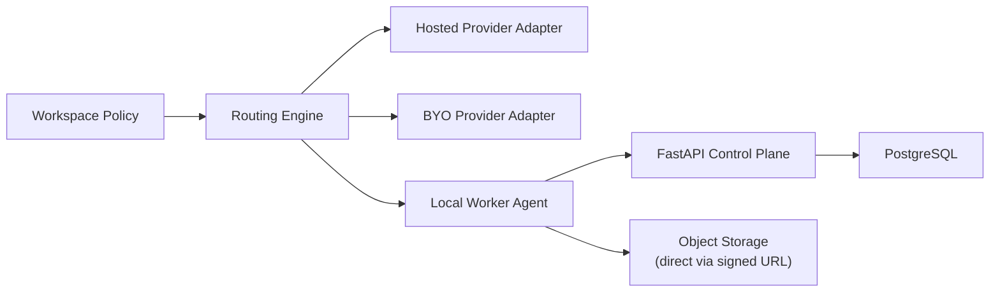

# Phase 7 Architecture

## Components Added

- Workspace provider credential vault
- Local worker registration service
- Routing policy engine
- Worker health and capability tracking
- Hybrid usage accounting

## Flow

## Phase 3 Preparation Reminder

The `POST /api/v1/workers/register` endpoint stub (returning `501 Not Implemented`) was introduced in Phase 1. In Phase 7, this endpoint and its siblings (`heartbeat`, `jobs/next`, `jobs/{id}/result`) are fully implemented. No new API surface is added to the catalog for local workers — only the stub implementations are activated.

The routing engine was designed with a local worker capability slot from Phase 4 onwards. In Phase 7, this slot is fully connected.

## Data Changes

- Add encrypted BYO credential records.
- Add local worker records, capability metadata, and heartbeat history.
- Extend provider run records with `execution_mode` (`hosted`, `byo`, `local`) and `worker_id`.
- Add workspace routing preferences by modality.

## API Surface Activated (from Phase 1/3 stubs)

- `POST /api/v1/workers/register` — full implementation
- `POST /api/v1/workers/{worker_id}/heartbeat` — full implementation
- `GET /api/v1/workers/{worker_id}/jobs/next` — full implementation
- `POST /api/v1/workers/{worker_id}/jobs/{step_id}/result` — full implementation
- `POST /api/v1/workspaces/{workspace_id}/routing-policy` — workspace execution routing configuration
- `GET /api/v1/admin/workers` — operator view of all registered local workers
- `DELETE /api/v1/admin/workers/{worker_id}` — operator revocation of local worker

## Frontend Structure

- Provider settings page with BYO credential management
- Execution mode routing policy UI
- Local worker status view (registration, heartbeat, capability, last-seen)
- Expanded usage pages showing hosted versus BYO versus local execution splits

## Risk Controls

- Secrets must never be returned to the frontend after the initial write. BYO credential forms show only masked summaries post-creation.
- Local worker trust boundaries are defined in `13-local-worker-agent-protocol.md`. Workers are scoped to their registered workspace and can access only job steps assigned to them via pre-signed URLs.
- Routing must fail closed: if a workspace routing policy is invalid, misconfigured, or references an offline worker, the routing engine falls back to hosted execution and logs the fallback reason — it does not queue the job in an unresolvable state.
- Do not enable Phase 7 features until hosted usage accounting and Phase 4 operational visibility are fully trusted.

