# Reels Generation Studio — Frontend

A **dark cinematic web application** for AI-powered short-form video (reels) production. Built with React, TypeScript, Vite, and TanStack Query. The entire production workflow lives in one place — from creative brief through scene planning, render monitoring, and final export delivery.

---

## Tech Stack

| Tool | Purpose |
|---|---|
| **React + TypeScript** | UI framework |
| **Vite** | Dev server & bundler |
| **React Router v6** | Client-side routing |
| **TanStack Query** | Data fetching & caching |
| **Zustand** | UI state management |
| **Inter + Manrope** | Typography (Google Fonts) |
| **Vanilla CSS** | Design system (no Tailwind) |

## Getting Started

```bash
# Install dependencies
npm install

# Start the development server
npm run dev
# → http://localhost:5173

# Build for production
npm run build
```

---

## Design System

The UI follows a **dark cinematic studio** aesthetic — deep navy surfaces, indigo/violet gradient accents, glassmorphism panels, and animated gradient backgrounds. All styling lives in `src/styles/index.css`.

| Token | Value | Used For |
|---|---|---|
| Background | `#05080f` | App base |
| Surface card | `#0c1220` | Cards & panels |
| Accent gradient | `#6366f1 → #8b5cf6` | Buttons, active states, progress |
| Text primary | `#f0f4ff` | Headings & body |
| Text secondary | `#8899bb` | Metadata & descriptions |
| Success | `#34d399` | Approved / Ready states |
| Warning | `#fbbf24` | Blocked / Review states |
| Error | `#f87171` | Failed states |

---

## Application Pages

### 1. Login Page

The entry point to the studio. Features a **large typographic hero** on the left with a 4-tile feature overview grid, and a **glassmorphism login card** on the right with direct links to the Creator Workspace and Admin Queue.

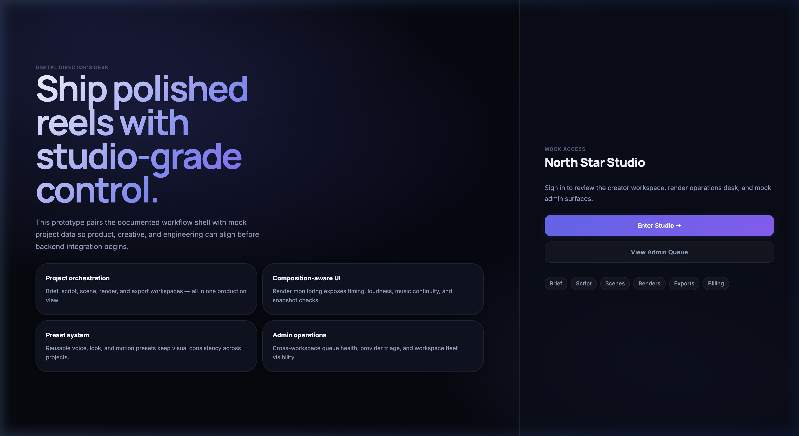

**Features:**
- `Enter Studio →` — navigates to the creator workspace dashboard
- `View Admin Queue` — jumps to the admin operations desk
- Feature pills at the bottom preview available workspace sections

---

### 2. Dashboard (`/app`)

The **Digital Director's Desk** — command center showing the most critical studio state at a glance.

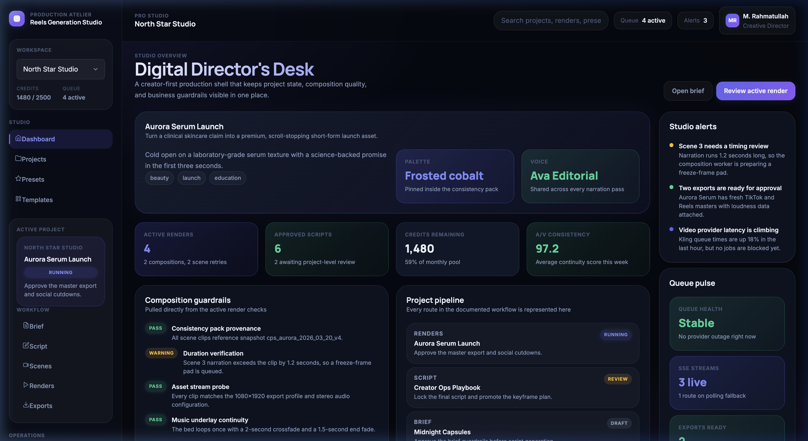

**Panels & Features:**
- **Focus project hero card** — active project hook, palette, and voice preset
- **4 metric cards** — Active Renders, Approved Scripts, Credits Remaining, A/V Consistency score
- **Composition guardrails** — live status of render pipeline checks (pass / warning / fail)
- **Project pipeline** — all projects ordered by stage with render status badges
- **Studio alerts** *(right inspector)* — color-coded alerts with warning details
- **Queue pulse** *(right inspector)* — real-time queue health, live SSE stream count, export readiness

---

### 3. Projects Library (`/app/projects`)

A **card grid** showing all active productions across all workflow stages.

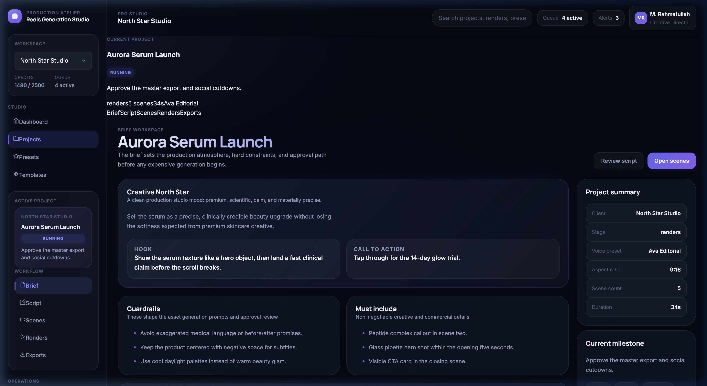

**Features:**
- Each card: title, objective, stage badge, duration, palette preset, voice preset
- **Script** and **Open project** quick-action buttons per card
- **Portfolio view** inspector — total projects, in-render count, in-planning count
- Status badges (`RUNNING`, `REVIEW`, `DRAFT`) give instant pipeline visibility

---

### 4. Brief (`/app/projects/:id/brief`)

The **creative foundation** for a project. Sets the brand north star, production constraints, and approval path before any generation begins.


**Sections:**
- **Creative North Star card** — brand objective, hook, and call-to-action side by side
- **Guardrails** — hard constraints shaping all asset generation prompts
- **Must include** — non-negotiable commercial and creative requirements
- **Approval sequence** — numbered steps with accent badges showing the gated review path
- **Project summary** *(inspector)* — client, stage, voice preset, aspect ratio, scene count, duration

---

### 5. Script (`/app/projects/:id/script`)

A **dense but readable** script review workspace with per-scene timing, voice continuity, and approval state.

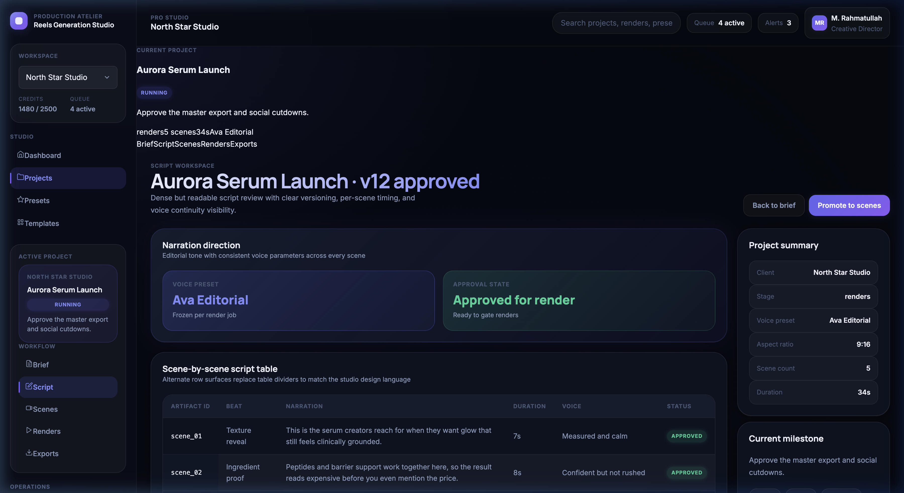

**Sections:**
- **Narration direction card** — voice preset and approval state metric cards
- **Scene-by-scene script table** — artifact ID, beat, narration, duration, voice pacing, status. Uses alternating row tones instead of dividers
- **Beat handoff cards** — compact 3-column grid of visual direction and pacing cues per scene
- **Script facts** *(inspector)* — approval state, word count, reading time, last edited

---

### 6. Scenes (`/app/projects/:id/scenes`)

A **split-pane scene planner** — interactive timeline list on the left, scene detail canvas on the right.

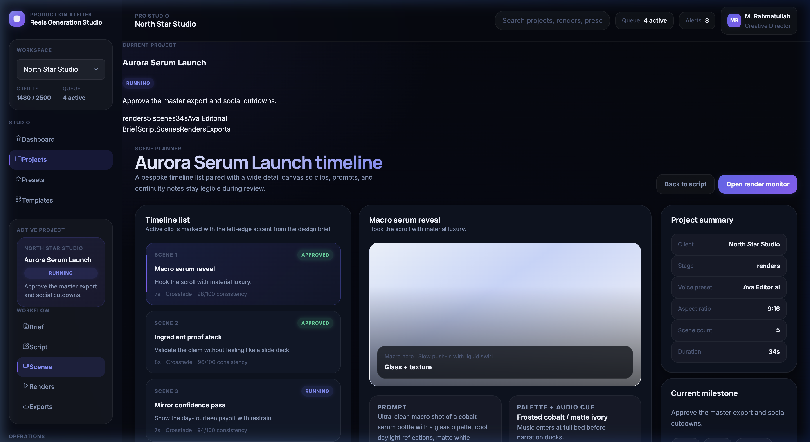

**Features:**
- **Timeline list** — clickable scene cards with a `2.5px` left-edge accent on the active scene
- Each item: scene index, status badge, title, beat, duration, transition mode, continuity score
- **Scene detail canvas** — media frame thumbnail, prompt, palette + audio cue, continuity notes
- **Transition map** — compact 3-column grid showing every scene's transition mode
- **Selected scene** *(inspector)* — continuity score, keyframe status, subtitle state

---

### 7. Renders (`/app/projects/:id/renders`)

The **render monitor** — surfaces job health, composition gates, SSE state, and per-scene execution timing.

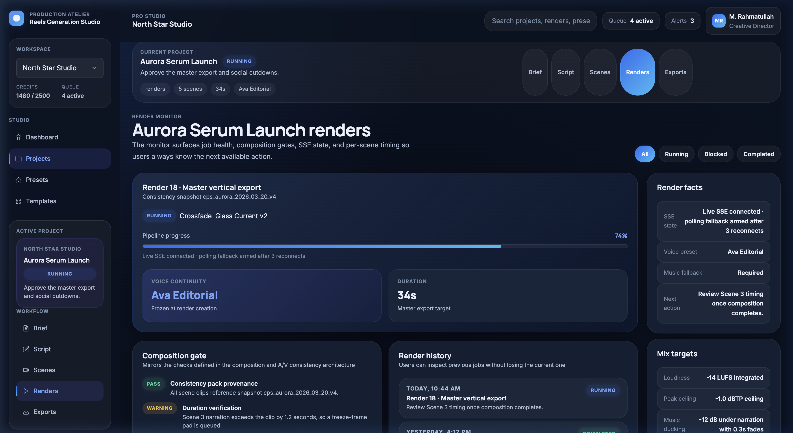

**Features:**
- **Filter chips** — All / Running / Blocked / Completed
- **Active render hero card** — label, consistency snapshot ID, status, transition mode, music track, pipeline progress bar
- **Composition gate** — pass/warning/fail checklist mirroring the A/V consistency architecture
- **Render history** — all jobs with timestamps, labels, next action, and status badges
- **Per-scene execution matrix** — table of every scene step: status, duration delta, clip state, narration state, next action
- **Event stream** — SSE-style live event log with color-coded tone dots and timestamps
- **Render facts** *(inspector)* — SSE state, voice preset, music fallback rule, next action
- **Mix targets** *(inspector)* — loudness (LUFS), true peak, music ducking, subtitle state

---

### 8. Exports (`/app/projects/:id/exports`)

The **export library** — final delivery surface showing audio metrics, channel readiness, and file details.

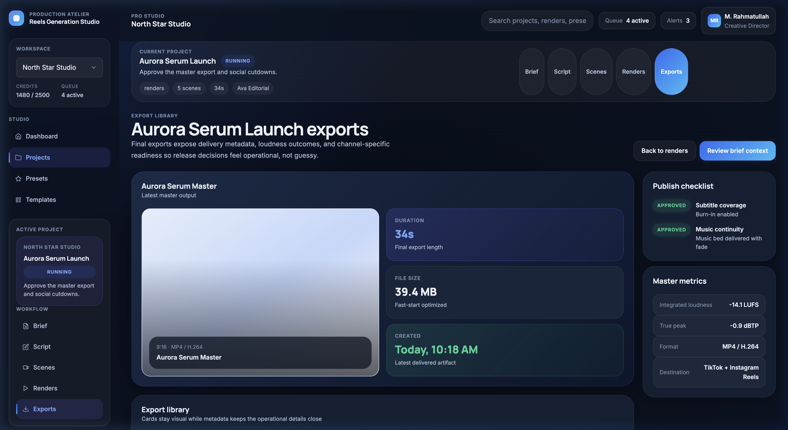

**Features:**
- **Latest export hero** — wide media frame with duration, file size, and created date metric cards
- **Export library grid** — a card per export variant with media thumbnail, status, duration, file size, destination
- **Delivery notes** — audio and visual continuity confirmation panels
- **Publish checklist** *(inspector)* — subtitle coverage and music continuity status checks
- **Master metrics** *(inspector)* — integrated loudness, true peak, format, delivery destination

---

### 9. Presets (`/app/presets`)

The **shared systems library** — reusable voice, look, and motion presets shared across all projects.

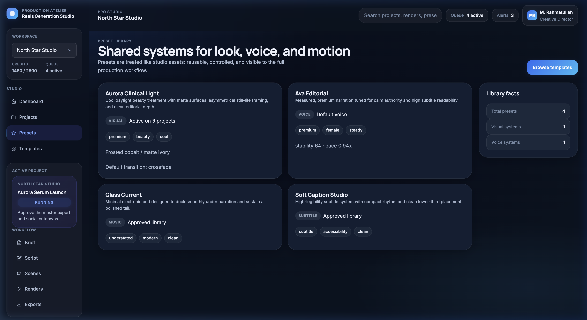

**Features:**
- Cards per preset: name, description, category badge (`visual` / `voice`), status, tags
- Preset-specific fields: look description, voice description, or default transition mode
- **Library facts** *(inspector)* — total count, visual systems count, voice systems count
- Browse Templates quick-action button

---

### 10. Templates (`/app/templates`)

**Production starters** — pre-packaged scene counts, duration bands, and visual tones for quick project creation.

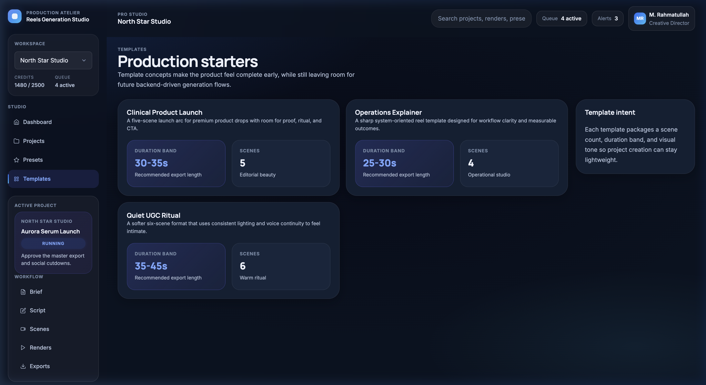

**Features:**
- Template cards: name, description, duration band, scene count, style label
- **Template intent** *(inspector)* — explains the role of templates in future project creation flows

---

### 11. Settings (`/app/settings`)

**Workspace operating rules** — configuration settings covering workflow defaults, approval gates, and business controls.

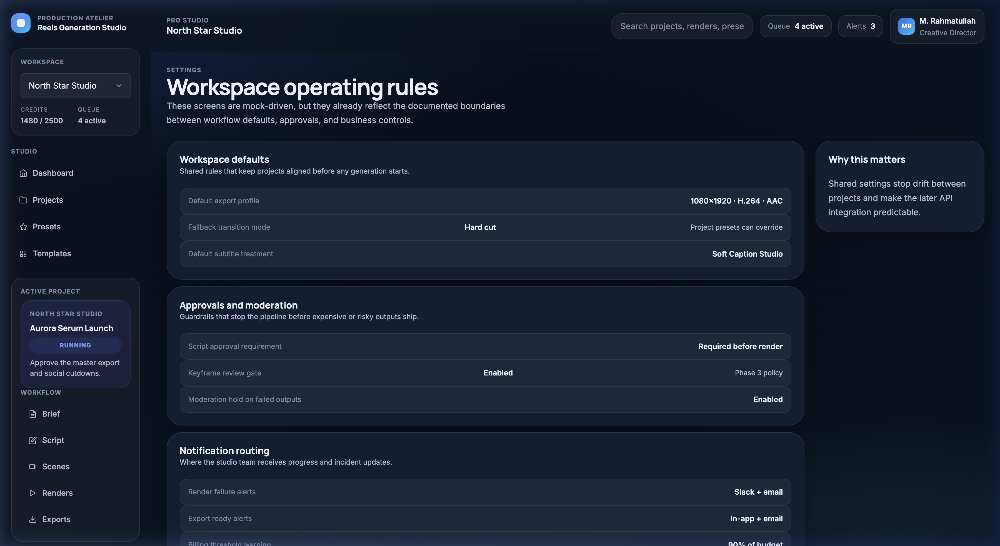

**Features:**
- Grouped setting sections — each with title, description, and key/value pairs
- Each item can include an additional status note
- Mirrors the documented configuration boundaries between workflow defaults and future API integration

---

### 12. Billing (`/app/billing`)

**Metered production economics** — credits position, usage breakdown, and invoice ledger.

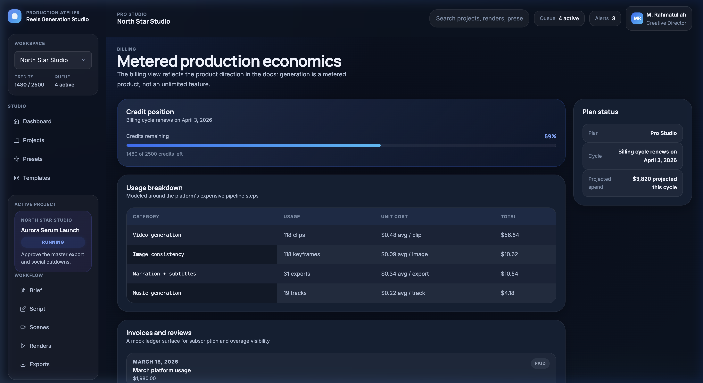

**Features:**
- **Credit position hero card** — animated progress bar showing credits remaining
- **Usage breakdown table** — category, units consumed, unit cost, and total cost per pipeline step
- **Invoices list** — date, label, amount, and payment status per invoice
- **Plan status** *(inspector)* — plan tier, billing cycle, projected spend

---

### 13. Admin Queue (`/admin/queue`)

The **operational queue desk** — separate from the creator workspace but sharing the same visual system.

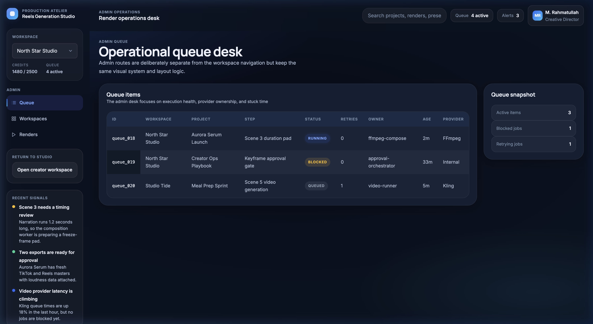

**Features:**
- Queue table: ID, workspace, project, step, status, retry count, owner, age, provider
- **Queue snapshot** *(inspector)* — total active items, blocked jobs, retrying jobs
- Sticky first column for horizontal scrolling through dense data
- Alternating row tones replace borders for a clean, dense-readable layout

Also available under `/admin`:
- **`/admin/workspaces`** — Cross-workspace fleet table: plan, seats, credits, render load, health, renewal date
- **`/admin/renders`** — Cross-workspace render health: provider, cost, stuck duration, issue triage, consistency snapshot

---

## Navigation Structure

```
/                              Login
/app                           Dashboard
/app/projects                  Projects Library
/app/projects/:id/brief        Brief Workspace
/app/projects/:id/script       Script Workspace
/app/projects/:id/scenes       Scene Planner
/app/projects/:id/renders      Render Monitor
/app/projects/:id/exports      Export Library
/app/presets                   Preset Library
/app/templates                 Templates
/app/settings                  Settings
/app/billing                   Billing
/admin/queue                   Admin Queue
/admin/workspaces              Admin Workspace Fleet
/admin/renders                 Admin Render Health
```

---

## Project Structure

```
frontend/
├── src/
│   ├── app/
│   │   ├── App.tsx              # Root component
│   │   ├── AppProviders.tsx     # QueryClient + Router providers
│   │   └── router.tsx           # Route definitions
│   ├── components/
│   │   └── ui.tsx               # Shared UI components (see table below)
│   ├── lib/
│   │   ├── mock-api.ts          # Mock data & async fetchers
│   │   └── format.ts            # Duration, percent, status label formatters
│   ├── routes/
│   │   ├── app-pages.tsx        # Creator workspace pages (Dashboard → Billing)
│   │   ├── admin-pages.tsx      # Admin pages (Queue, Workspaces, Renders)
│   │   └── login-page.tsx       # Login / landing page
│   ├── state/
│   │   └── ui-store.ts          # Zustand store (active project, workspace, filters)
│   ├── styles/
│   │   └── index.css            # Full design system (dark cinematic theme)
│   ├── types/
│   │   └── domain.ts            # TypeScript domain types
│   └── main.tsx                 # Entry point
├── docs/
│   └── screenshots/             # Page screenshots for documentation
├── index.html
├── DESIGN.md                    # Design system specification
├── README.md                    # This file
├── package.json
└── vite.config.ts
```

---

## Shared UI Components

| Component | Description |
|---|---|
| `ShellLayout` | Outer chrome: glassmorphism nav rail + topbar + `<Outlet />` |
| `PageFrame` | Standard page: eyebrow, gradient title, description, actions, two-column grid + inspector |
| `SectionCard` | Dark surface card with title, optional subtitle, slotted children |
| `MetricCard` | KPI card with label, large value, detail, and semantic tone variant |
| `StatusBadge` | Pill badge auto-classified by status string (success / warning / error / primary / neutral) |
| `ProgressBar` | Labeled gradient progress bar with percentage and optional detail text |
| `MediaFrame` | Gradient media thumbnail with glassmorphism overlay label |
| `TimelineItem` | Clickable scene timeline button with left-edge accent on active state |
| `EmptyState` | Centered empty message with title and description |
